# ARP攻击与防护实验

## 一.环境搭建

1. **华为eNSP模拟器** - 用于构建网络拓扑
2. **VMware Workstation** - 用于运行Kali Linux虚拟机

### 1.网络拓扑搭建

* 在eNSP中创建以下设备：

  - 1台交换机(S5700)

  - 一台Client和一台Server(模拟客户端和服务器)

  - 1台Cloud(用于连接VMware虚拟机)

* 配置网络：

  - 所有设备在同一子网(192.168.10.0/24)

  - 分别为Client和Server配置IP(192.168.10.20, 192.168.10.30)

  - 在Server上启用FTP服务

* 连接VMware虚拟机：

  - 在eNSP云设备上配置桥接到VMware虚拟网络

  - 确保Kali虚拟机与eNSP网络在同一子网

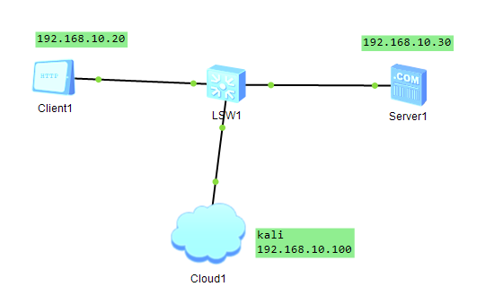

### 2.设备配置

* 交换机

  1. **登录交换机**

     ```shell
     <Huawei> system-view  # 进入系统视图
     [Huawei] sysname SW1  # 重命名交换机
     ```

  2. **接口配置（初始无VLAN）**

     ```shell
     [SW1] interface GigabitEthernet 0/0/1
     [SW1-GigabitEthernet0/0/1] port link-type access  # 设置接口模式
     [SW1-GigabitEthernet0/0/1] port default vlan 1    # 默认VLAN 1
     [SW1-GigabitEthernet0/0/1] undo shutdown         # 启用接口
     ```

     

  3. **连接云设备的接口配置**

     ```shell
     [SW1] interface GigabitEthernet 0/0/24  # 连接eNSP云设备的接口
     [SW1-GigabitEthernet0/0/24] port link-type access
     [SW1-GigabitEthernet0/0/24] port default vlan 1
     ```

* VMware网络配置

1. **虚拟网络编辑器设置**

   - 选择VMnet8(NAT模式)

     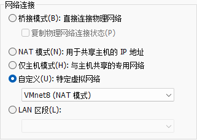

2. **Kali虚拟机配置**

   ```bash
   # 网络适配器选择自定义-VMnet8
   sudo nano /etc/network/interfaces
   # 添加以下内容：
   auto eth0
   iface eth0 inet static
    address 192.168.10.100
    netmask 255.255.255.0
    gateway 192.168.10.1
   ```

* Cloud配置

  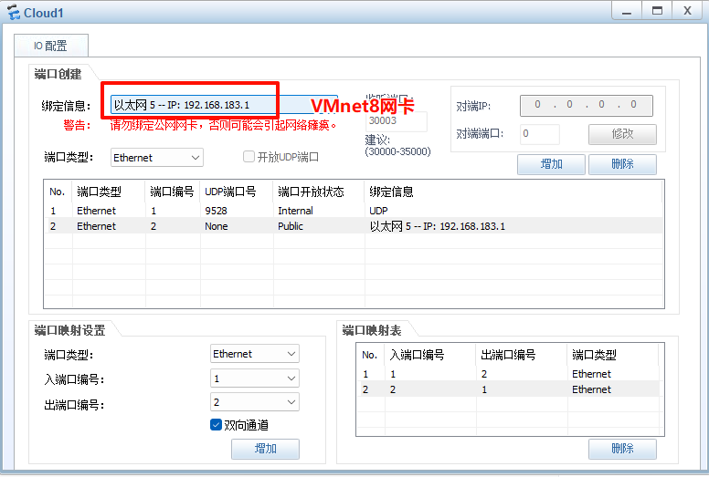

### 3.连通性测试

**从Kali测试**

```bash
ping 192.168.10.20  # Client
ping 192.168.10.30  # Server

ftp 192.168.10.30 # ftp 登录测试
```

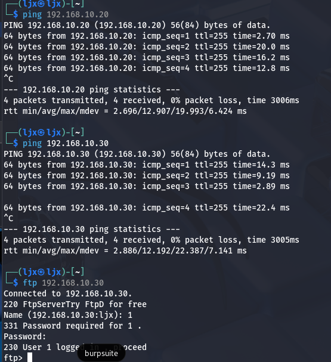

## 二.ARP欺骗攻击

### 1.使用Ettercap扫描网络主机

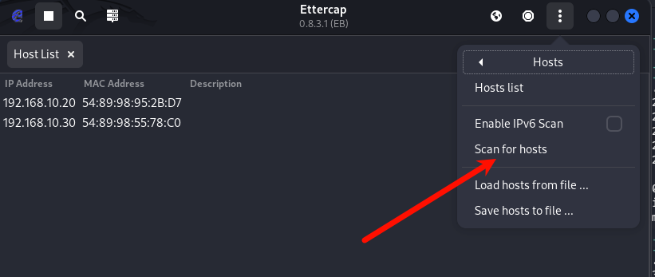

单击Ettercap上方的“三点”菜单 -> Hosts -> Scan for hosts，开始扫描网络中的所有主机

扫描完成后，单击“三点”菜单 -> Hosts -> Hosts list，可以确认主机列表

### 2.启用ARP欺骗

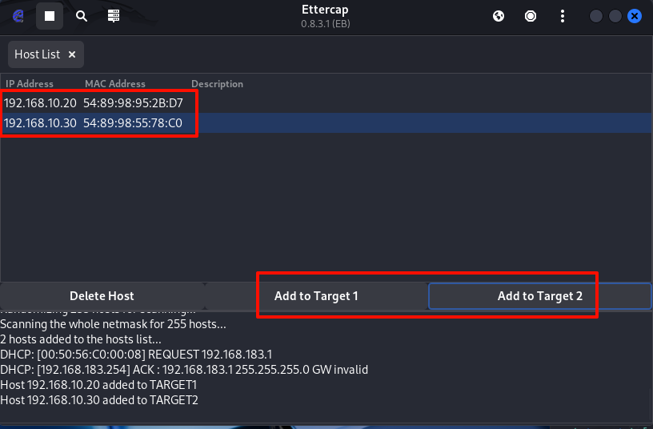

将Server和Client主机作为Ettercap嗅探的两个主要对象

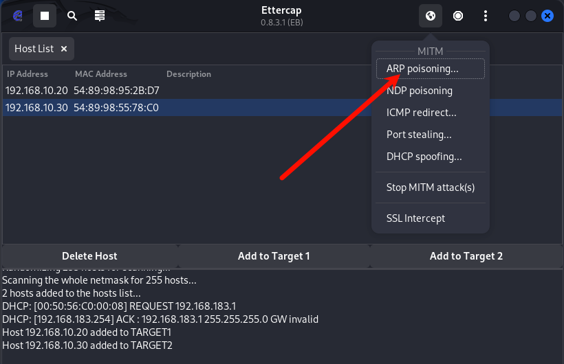

单击Ettercap上方的小地球图标 -> ARP poisoning

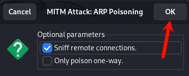

弹出小窗口中选择“OK”，然后就开始基于ARP欺骗方式的网络嗅探了

### 3.验证结果

从Client1访问Server1的FTP服务

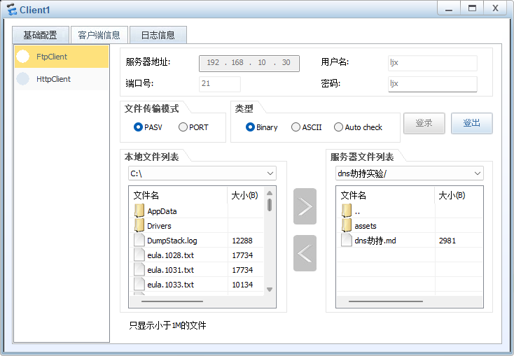

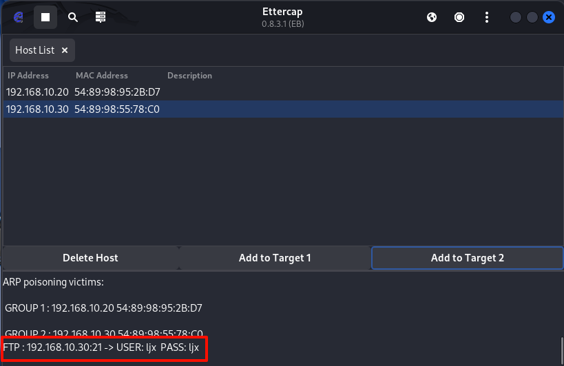

 嗅探成功后，能直接截获的用户名以及密码


抓包数据

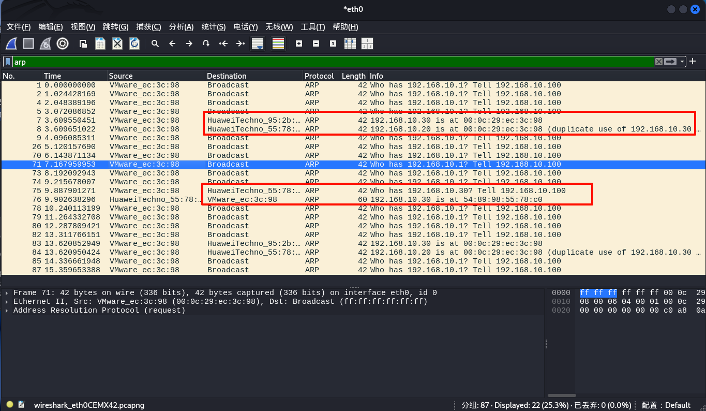

### 4.解析:

* **MAC地址冲突**

  - 在抓包数据中多次出现：

    ```text
    192.168.10.30 is at 00:06:29:cc:3c:98 (duplicate use of 192.168.10.30)
    192.168.10.20 is at 00:06:29:cc:3c:98 (duplicate use of 192.168.10.30)
    ```

  - **异常点**：不同IP（.20和.30）被声明为**同一个MAC地址**（Kali的MAC：`00:06:29:cc:3c:98`）

* **伪造ARP响应模式**

  - 正常情况：ARP响应应由真实设备发出

  - 当前情况：所有ARP响应均来自Kali（`VMware_ec:3c:98`）

* **具体攻击过程还原**

1. **攻击者行为**（Kali）：
   - 向交换机发送伪造的ARP响应：
     - "192.168.10.20的MAC是00:06:29:cc:3c:98"（实际应为Client1的真实MAC）
     - "192.168.10.30的MAC是00:06:29:cc:3c:98"（实际应为Server1的真实MAC）
2. **网络流量劫持**：
   - 当Client1访问Server1时，数据包被错误地发往Kali
   - Kali作为中间人可嗅探/篡改流量

**正常ARP表应显示**：

| IP地址        | MAC地址            |
| :------------ | :----------------- |
| 192.168.10.20 | (Client1的真实MAC) |
| 192.168.10.30 | (Server1的真实MAC) |

**被污染后的ARP表**：

| IP地址        | MAC地址（均为Kali） |
| :------------ | :------------------ |
| 192.168.10.20 | 00:06:29:cc:3c:98   |
| 192.168.10.30 | 00:06:29:cc:3c:98   |

## 三.vlan隔离防护

### 1.交换机配置

```shell
<SW1> system-view
[SW1] vlan batch 10 20 # 创建vlan 10 20

# 将Client1划入VLAN10
[SW1] interface GigabitEthernet 0/0/2  
[SW1-GigabitEthernet0/0/2] port link-type access  
[SW1-GigabitEthernet0/0/2] port default vlan 10  

# 将Server1划入VLAN10
[SW1] interface GigabitEthernet 0/0/3 
[SW1-GigabitEthernet0/0/3] port link-type access  
[SW1-GigabitEthernet0/0/3] port default vlan 10  

# 将cloud(kali)划入VLAN20
[SW1] interface GigabitEthernet 0/0/1
[SW1-GigabitEthernet0/0/1] port link-type access  
[SW1-GigabitEthernet0/0/1] port default vlan 20  
```

### **2、验证防护效果**

#### **1). 检查Kali的ARP欺骗尝试**

- 在Kali启动Ettercap攻击后：
  - 无法捕获跨VLAN的ARP请求/响应

#### **2). 查看交换机MAC表验证隔离**

```
<SW1> display mac-address
# 应显示不同VLAN的MAC地址完全隔离
```
