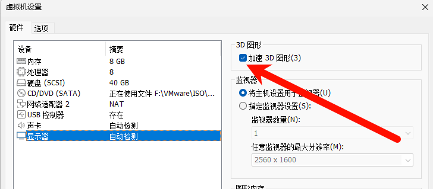

# VMWare Ubuntu24虚拟机开机黑屏,卡死解决方案

## 可能出现的异常情况

* 执行安装程序时屏幕花屏,闪烁
* 安装后启动黑屏
* 启动后能进入登录页面,但登陆后卡死,黑屏,ubuntu无法关机,vmware无响应

## 出现问题的原因

**Ubuntu24内部的图形加速驱动异常**

## 解决方案

### 1.安装旧版Ubuntu系统

目前仅发现在24版本会出现上诉问题,可以安装22及以下的系统

### 2.关闭虚拟机加速3D图形功能

* a.打开虚拟机设置
* b.点击`显示器`选项
* c.将`加速3D图形`取消勾选



### 3.更新系统图形驱动

先执行解决方案2的操作并重启进入系统,在终端中执行下面的操作

* a.添加更新源

```shell
sudo add-apt-repository ppa:oibaf/graphics-drivers
```

* b.更新软件包

```shell
sudo apt update
sudo apt upgrade
```

随后重启系统


参考文章: https://blog.csdn.net/qq_41830158/article/details/140569963
