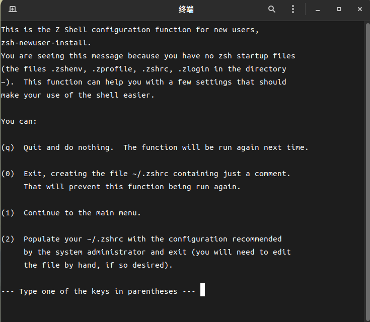
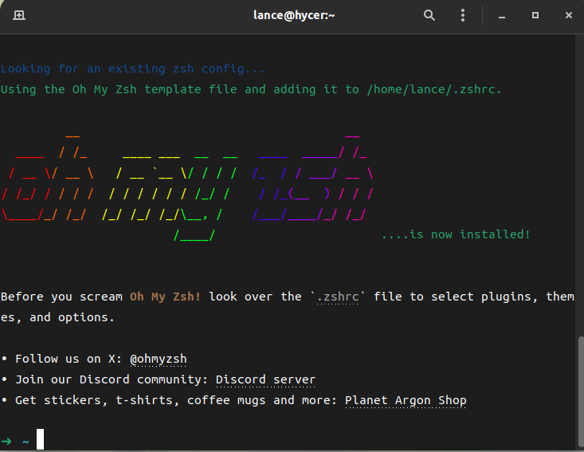
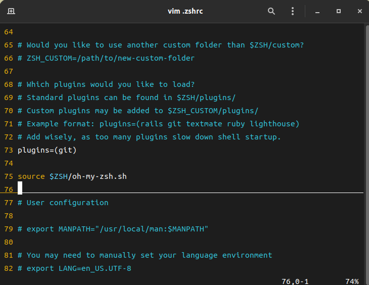
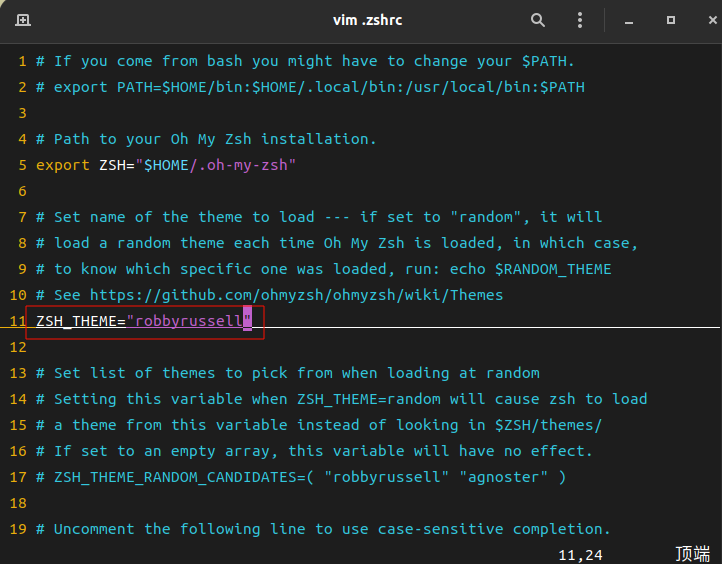
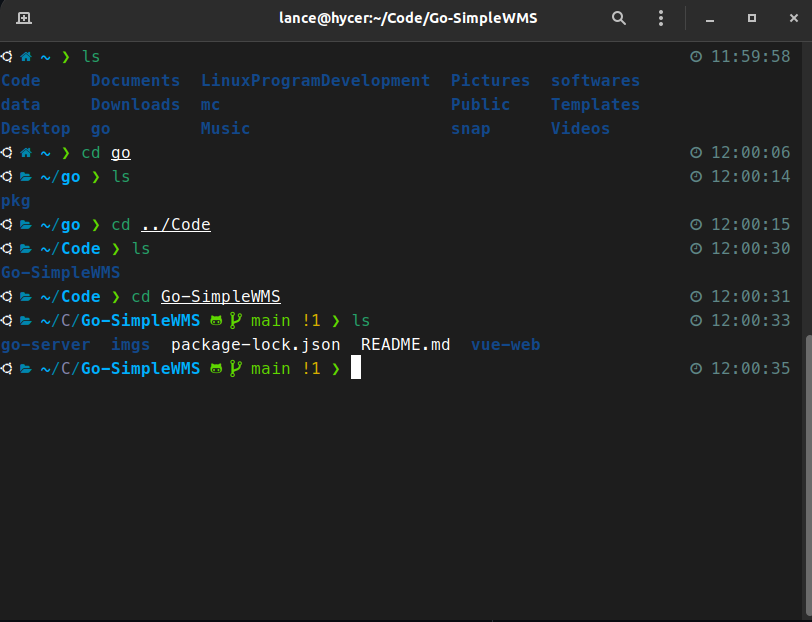

# zsh+oh-my-zsh+powerlevel10的linux shell美化

## zsh

### 安装zsh

```shell
sudo apt install zsh
```

### 将zsh设置为默认shell

```shell
chsh -s /bin/zsh
```
修改完成后需要退出当前用户登录(注销),随后再次打开终端即可进入zsh



## oh-my-zsh

### 安装oh-my-zsh

使用搜索引擎进入oh-my-zsh的[官网](https://ohmyz.sh)

根据官网的命令安装oh-my-zsh

```shell
sh -c "$(curl -fsSL https://raw.githubusercontent.com/ohmyzsh/ohmyzsh/master/tools/install.sh)"
```

无法访问github的可以使用gitee的镜像安装
```shell
sh -c "$(curl -fsSL https://gitee.com/mirrors/oh-my-zsh/raw/master/tools/install.sh \
    | sed 's|^REPO=.*|REPO=${REPO:-mirrors/oh-my-zsh}|g' \
    | sed 's|^REMOTE=.*|REMOTE=${REMOTE:-https://gitee.com/${REPO}.git}|g')"
```



### 安装插件

oh-my-zsh提供了很多实用的插件,通过[wiki](https://github.com/ohmyzsh/ohmyzsh/wiki/Plugins)查找需要的插件

推荐几个实用的插件:

* `zsh-autosuggestions` 自动建议补全
    ```shell
    git clone https://github.com/zsh-users/zsh-autosuggestions ${ZSH_CUSTOM:-~/.oh-my-zsh/custom}/plugins/zsh-autosuggestions
    ```
    使用方向键右键>可以自动补全命令
* `zsh-syntax-highlighting` 命令语法高亮
    ```shell
    git clone https://github.com/zsh-users/zsh-syntax-highlighting ${ZSH_CUSTOM:-~/.oh-my-zsh/custom}/plugins/zsh-syntax-highlighting
    ```
* `docker` oh-my-zsh自带的插件,可以支持docker命令语法
* `docker-compose` oh-my-zsh自带的插件,可以支持docker-compose命令语法
* `ufw` oh-my-zsh自带的插件,可以支持ufw命令语法
* `sudo` oh-my-zsh自带的插件,双击`esc`给当前命令加上`sudo`前缀

### 加载插件

编辑zsh的配置文件加载插件
```shell
vim ~/.zshrc
```


将需要加载的插件填入`plugins`

```text
plugins=(
         git
         docker
         docker-compose
         sudo
         ufw
         zsh-autosuggestions
         zsh-syntax-highlighting                                             
 )
```
保存,并使用`source ~/.zshrc`重新加载配置

```shell
source ~/.zshrc
```

## powerlevel10k主题安装

### 安装主题
```shell
git clone --depth=1 https://github.com/romkatv/powerlevel10k.git ${ZSH_CUSTOM:-$HOME/.oh-my-zsh/custom}/themes/powerlevel10k
```

### 加载主题

编辑zsh的配置文件加载主题
```shell
vim ~/.zshrc
```



修改为
```text
 ZSH_THEME="powerlevel10k/powerlevel10k"  
```

保存,并使用`source ~/.zshrc`重新加载配置

```shell
source ~/.zshrc
```

随后会进入pl10k主题的配置页面,跟随引导设置主题即可



如果配置不满意可以使用`p10k configure`重新进入配置引导

**另外因为更换了shell所以原来位于`/etc/profile`或`.bashrc`的环境变量需要转移到`.zshrc中`**
