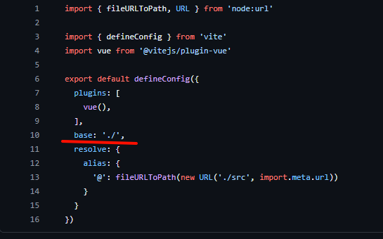

# 关于vue项目打包无法使用浏览器直接访问的问题

在使用GitHub Pages或其他静态网站托管部署vue项目时我发现不能访问

具体表现为404报错，静态资源无法访问

对于vite构建的项目，可通过修改vite.config.js中的默认静态资源路径解决此问题（下图的base字段）



另一个问题表现为无报错，但是显示空白，可能是路由的问题，需要将路由的history属性由createWebHistory函数改为createWebHashHistory函数（如下图）

:::code-group
```javascript [js]
const router = createRouter({
    history: createWebHashHistory(),
    routes,
});
```
```typescript [ts]
const router = createRouter({
    history: createWebHistory(),
    routes,    
});
```
:::
