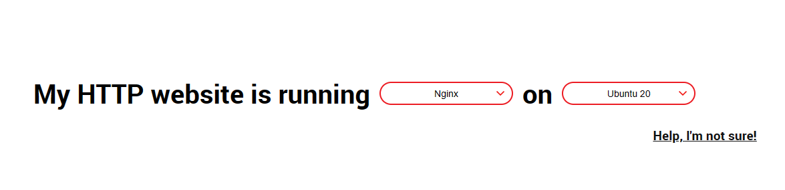

# 利用Nginx实现端口转发

起初需求源于：我有两台服务器，一台是我部署在家的无外网服务器，另一台为购买的阿里云vps。我的业务都运行在家庭服务器上，我通过frp内网穿透实现了从外网访问内网服务器的业务。但是，每次都需要通过ip+端口号来访问，非常的不方便。这时就需要Nginx的端口转发来实现ip+端口与域名绑定了。

## Nginx的安装

nginx服务需安装在有公网的服务器上

以Linux的Ubuntu系统为例，使用如下指令安装nginx服务

```bash
sudo apt update
sudo apt install nginx
```

安装完成后使用如下指令启动nginx服务

```bash
sudo systemctl start nginx
```

然后你可以通过一下命令查看nginx是否正常运行

```bash
sudo systemctl status nginx
```

如果你看到"`active (running)`"的状态，那么Nginx就已经成功启动了。

## 配置端口转发

Nginx的配置文件通常位于`/etc/nginx/`目录下，主配置文件是`/etc/nginx/nginx.conf`，但是通常我们会在`/etc/nginx/sites-available/`目录下创建单独的配置文件，然后创建一个链接到`/etc/nginx/sites-enabled/`目录，这样做的好处是可以方便地启用和禁用某个站点的配置。

以下是一个基本的Nginx配置文件的例子，它将所有到你的域名的请求转发到本机的7000端口（你需要将这个端口改成你的frp内网穿透的端口）：

```
server {
    listen 80;
    server_name your-domain.com; # 将这里改成你的域名

    location / {
        proxy_pass http://localhost:7000; # 将这里的7000改成你的frp内网穿透的端口
        proxy_set_header Host $host;
        proxy_set_header X-Real-IP $remote_addr;
        proxy_set_header X-Forwarded-For $proxy_add_x_forwarded_for;
    }
}
```

你可以将这个配置文件保存为`/etc/nginx/sites-available/my-site`，然后创建一个链接到`/etc/nginx/sites-enabled/`目录：

(这样是为了分离配置文件,易于维护)

```bash
sudo ln -s /etc/nginx/sites-available/my-site /etc/nginx/sites-enabled/
```

然后，你需要重启Nginx来应用新的配置：

```bash
sudo systemctl restart nginx
```

最后将你的域名解析到nignx服务器上

现在，你应该能够通过你的域名来访问你的服务了。


## 附言 安装SSL证书实现https访问

以上操作只能通过http访问对应的服务，如果想使用https又该怎么办呢？

### 通过certbot安装SSL证书

[certbot ](https://certbot.eff.org/)一个能免费安装SSL证书的网站

在主页选择要安装的服务类型（nginx apache等等）和系统

随后网页会给出对应的安装方法，依次执行即可
