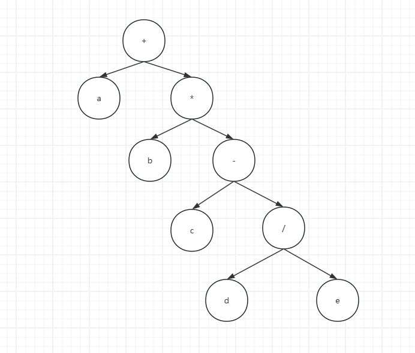

# 前,中,后缀表达式

## 中缀表达式

中缀表达式就是我们常用的数学表达方式,按照**操作符**在**操作数****中间**的方式排列数学表达式

例如:

```text
a + b * ( c - d / e )
```

## 前缀表达式

前缀表达式又称**波兰式**，前缀表达式的运算符位于操作数**之前**

例如中缀表达式`a+b*(c-d/e)`的前缀表达式为:

```text
+ a b * c - d / e
```

### 中缀表达式转为前缀表达式
转换步骤如下:

（1）初始化两个栈:运算符栈 s1，储存中间结果的栈 s2

（2）从右至左扫描中缀表达式

（3）遇到操作数时，将其压入 s2

（4）遇到运算符时，比较其与 s1 栈顶运算符的优先级

a：如果 s1 为空，或栈顶运算符为右括号 “ ) ”，则直接将此运算符入栈
b：否则，若优先级比栈顶运算符的较高或相等，也将运算符压入 s1
c：否则，将 s1 栈顶的运算符弹出并压入到 s2 中，再次转到 ( 4 - 1 ) 与 s1 中新的栈顶运算符相比
（5）遇到括号时

a：如果是右括号“)”，则直接压入 s1
b：如果是左括号“(”，则依次弹出 s1 栈顶的运算符，并压入 s2 ，直到遇到右括号为止，此时将这一对括号丢弃
（6）重复步骤（2）至（5），直到表达式的最左边

（7）将 s1 中剩余的运算符依次弹出并压入 s2

（8）依次弹出 s2 中的元素并输出，结果即为中缀表达式对应的前缀表达式。

## 后缀表达式

后缀表达式又称**逆波兰式**，后缀表达式的运算符位于操作数**之后**

例如中缀表达式`a+b*(c-d/e)`的后缀表达式为:

```text
a b c d e / - * +
```

### 中缀表达式转后缀表达式

转换步骤如下:

（1）从左到右扫描中缀表达式。

（2）若遇到操作数，则将其输出。

（3）若遇到操作符 op：

a:若操作符 op 的优先级高于栈顶操作符，或栈为空，则将 op 压入栈中。
b:否则，弹出栈顶操作符，并输出，直到遇到优先级小于或等于 op 的操作符，然后将 op 压入栈中。

（4）若遇到左括号 (，则将其压入栈中。 

（5）若遇到右括号 )，则依次弹出栈顶操作符并输出，直到遇到左括号 ( 为止。弹出左括号但不出，仅为保持括号平衡。

## 根据二叉树转换表达式

中缀表达式`a+b*(c-d/e)` 转换为二叉树为:

 

前,中,后缀表达式分别对应二叉树的前,中,后序遍历的结果
