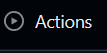
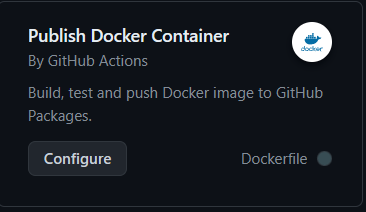
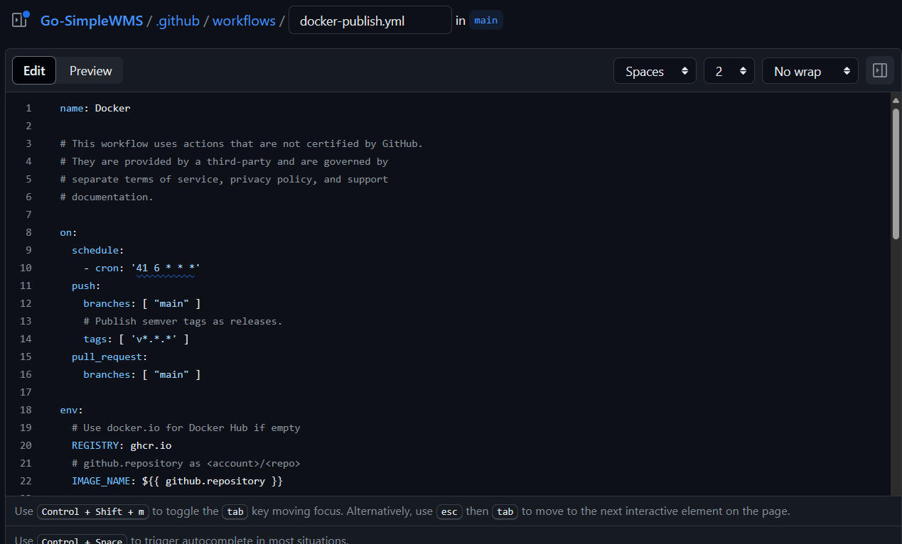
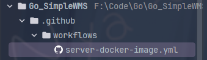
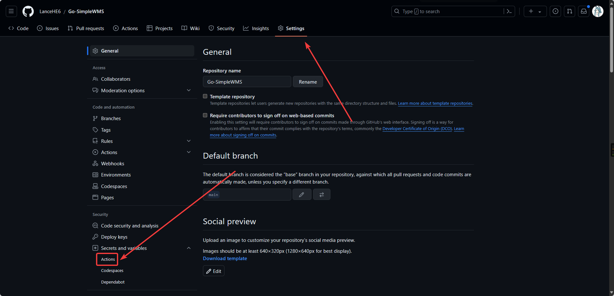
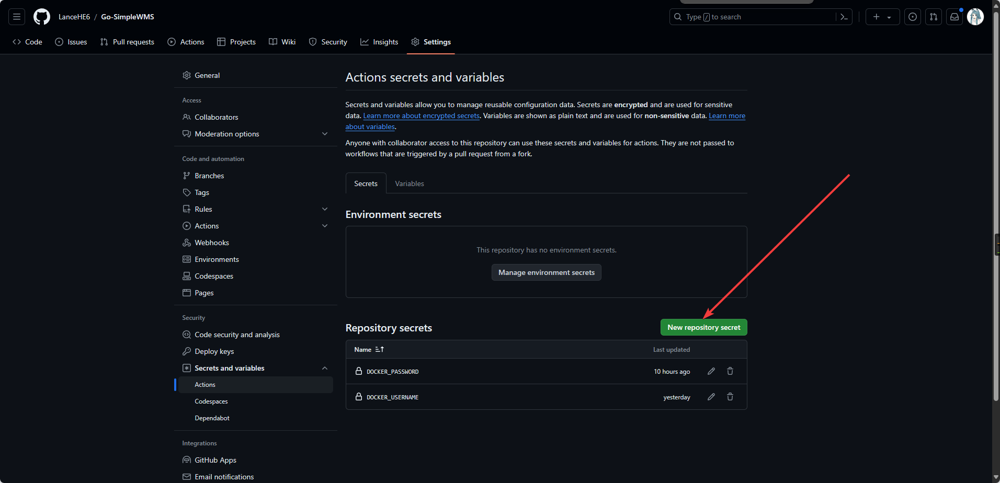
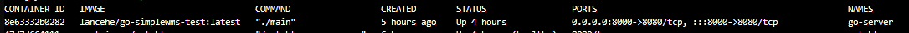
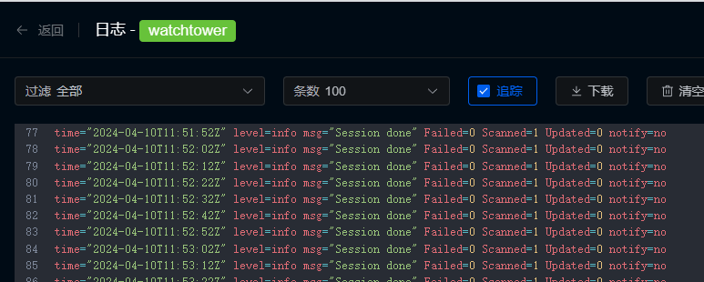

# 基于GitHub Action与Docker watchtower的CI/CD


需求来于近期开发的前端需要后端运行进行调试，所以想把后端服务部署在服务器上，但又因为后端开发迭代很快，所以就需要一种持续部署方式来解决此问题。

首先先理解几个概念。

### **项目CI/CD**

在互联网开发中，CI 和 CD 是两个常用的缩写词，分别代表持续集成（Continuous Integration）和持续交付/持续部署（Continuous Delivery/Continuous Deployment）。

**持续集成（Continuous Integration，CI）：**
持续集成是一种开发实践，旨在通过频繁地将代码合并到主干分支，并进行自动化构建、测试和部署等操作，以确保团队成员的工作能够快速且无冲突地集成到共享代码库中。CI 的目标是尽早发现和解决代码集成问题，并提供可靠的构建和测试过程，以减少集成带来的风险。

在 CI 中，开发者在完成某项工作后，会将代码变更提交到版本控制系统（如 Git），触发自动化构建和测试流程。这些流程通常包括编译代码、运行单元测试、进行静态代码分析等。如果构建和测试通过，代码变更就可以合并到共享代码库，否则需要开发者修复问题。

**持续交付/持续部署（Continuous Delivery/Continuous Deployment，CD）：**
持续交付和持续部署是指在 CI 的基础上，通过自动化流程将经过验证的代码变更交付给生产环境。

**持续交付（Continuous Delivery）：**持续交付意味着代码变更通过了构建和测试，并已经准备好进行部署，但是部署的时机由人工决定。在持续交付中，开发团队可以随时选择将已验证的代码发布到生产环境，以快速响应用户需求或满足业务的要求。

**持续部署（Continuous Deployment）：**持续部署是在持续交付的基础上更进一步，自动化地将经过验证的代码变更直接部署到生产环境，无需人工干预。在持续部署中，如果代码通过了构建和测试，它将立即被部署到生产环境，从而实现快速的软件发布。

总结来说，**CI** 是一种开发实践，旨在帮助团队更好地集成和验证代码，而 **CD** 则进一步强调了对代码变更的自动化交付和部署。持续集成和持续交付/持续部署的实践能够提高开发效率、减少错误，并使团队能够更快地交付高质量的软件产品。

### **Github Actions**

**GitHub Actions** 是一个持续集成（Continuous integration）和持续交付（Continuous delivery）的平台，它可以做到自动化构建、测试、部署。你可以创建工作流，构建和测试每一个 **pull request** 或者部署合并后的代码到生产环境。GitHub Actions 可以在你的代码仓库发生某个事件时运行一个工作流。举个例子，当有人给你的项目提出issue时，可以自动通知团队成员等。GitHub 提供了 Linux、Windows、和 macOS 虚拟机运行你的工作流，当然你也可以自定义运行环境。

在本文中主要用于使用Github Actions来进行项目CI，当有代码提交到指定分支时，会自动打包容器镜像并推送到docker hub，用于更新镜像仓库的镜像。

## 实现流程

采用docker部署，利用GitHub Action 在每次提交特定消息时进行镜像构建，再推送至docker hub；

watchtower定时检查容器镜像是否更新，实现容器自动迭代升级。

## GitHub Action

GitHub Actions 是一种持续集成和持续交付 (CI/CD) 平台，可用于自动执行生成、测试和部署管道。 你可以创建工作流程来构建和测试存储库的每个拉取请求，或将合并的拉取请求部署到生产环境。GitHub 提供 Linux、Windows 和 macOS 虚拟机来运行工作流程，或者可以在自己的数据中心或云基础架构中托管自己的自托管运行器。

这里我以我项目的gin后端为例，首先项目需上传进GitHub仓库，随后点击仓库的Action



点击新增工作流`New Wrokflow`,再找到***build and push docker container\***这个action并点击***configure\***

**

它会在你仓库根目录创建.github/workflows文件夹来保存action

你也可以直接在项目路径下新建action的yml文件



这里我的需求是在commit中含有#docker-push字段时触发action，action自动将我commit 的后端代码打包成镜像并上传至docker hub。具体action代码如下

```
#workflow名称
name: Build Test Environment Image
# 触发条件 在backend-dev分支上push时触发
on:
  push:
    branches:
      - backend-dev
#变量配置      
env:
  #dockerHub仓库名称
  DOCKER_REGISTRY: lancehe/go-simplewms-test

jobs:
  build-image:
    #运行的环境  
    runs-on: ubuntu-latest
    env:
      TZ: Asia/Shanghai
    steps:
      # 拉取代码
      - uses: actions/checkout@v3
      # 检查提交信息 当提交信息中包含 #docker-push 时，才构建并推送镜像
      - name: Check commit message
        id: check_message
        run: |
            if echo "${{ github.event.head_commit.message }}" | grep -q "#docker-push"; then
              echo "::set-output name=RUN_TESTS::true"
            else
              echo "::set-output name=RUN_TESTS::false"
            fi

      # 登录镜像仓库
      - name: Login Docker Hub
        if: steps.check_message.outputs.RUN_TESTS == 'true'
        uses: docker/login-action@v2
        with:
          #这里引用仓库的secrets登录dockerhub
          username: ${{ secrets.DOCKER_USERNAME }} # dockerhub 用户名
          password: ${{ secrets.DOCKER_PASSWORD }} # dockerhub 密码
      # 打包构建并推送
      - name: Build and push
        if: steps.check_message.outputs.RUN_TESTS == 'true'
        uses: docker/build-push-action@v4
        with:
          context: ./go-server # dockerfile位于go-server文件夹下
          dockerfile: Dockerfile
          platforms: |
            linux/amd64
          #推送到镜像仓库  
          push: true
          # 镜像标签
          tags: |
            ${{ env.DOCKER_REGISTRY }}:latest
```

*注：构建镜像的dockerfile需提前写好放在项目目录下*

随后将写好的action推送至github仓库

action在执行过程中会登录我的docker hub账号用于推送镜像，为了隐私安全GitHub提供了仓库secrets(类似于环境变量)用于保存我们的信息，并能让action读取。

在仓库的setting中，点击*secrets and variables*中的action来添加我们dokcer hub的用户名和密码





至此，我们已经实现了当提交内容含有#docker-push触发action自动构建镜像并推送至docker hub的工作。


## watchtower

**Watchtower** 是一款自由开源的容器应用，用来监控运行中的 Docker 容器，并且当它发现基础镜像被更改后，可以自动的更新容器。

若 Watchtower 发现一个运行中的容器需要更新，它会以发送 SIGTERM 信号的方式，优雅的结束运行中容器的运行。

它会下载新镜像，然后以最初部署时使用的方式，重启容器。所有文件会在后台自动下载，因此不需要用户的介入。

这里我已经将action构建的镜像部署在服务器，并命名为go-server，随后我们需要拉取watchtower镜像并配置它

我们使用docker compose来部署，并让它只检查go-server这个容器，当更新完成时发送邮件提醒我们

```
version: '3'
services:
  watchtower:
    image: containrrr/watchtower
    volumes:
      - /var/run/docker.sock:/var/run/docker.sock
    command: go-server --interval 10 --cleanup # 只检查go-server容器，检查间隔10s， 删除旧镜像
    environment:
      - WATCHTOWER_NOTIFICATIONS=email # 提醒方式为发送邮件
      - WATCHTOWER_NOTIFICATION_EMAIL_FROM=2765543491@qq.com # 发送邮件使用的邮箱
      - WATCHTOWER_NOTIFICATION_EMAIL_TO=hycerlance@gmail.com # 接收邮件的邮箱
      - WATCHTOWER_NOTIFICATION_EMAIL_SERVER=smtp.qq.com # 发送邮件的smtp服务器
      - WATCHTOWER_NOTIFICATION_EMAIL_SERVER_PORT=587 # 服务器端口，默认为587
      - WATCHTOWER_NOTIFICATION_EMAIL_SERVER_USER=2765543491@qq.com # 发送邮箱登录账号
      - WATCHTOWER_NOTIFICATION_EMAIL_SERVER_PASSWORD=owxfbbuxrsoofdfsif # 邮箱授权码（不是邮箱密码需到官网设置）
      - WATCHTOWER_NOTIFICATION_EMAIL_DELAY=2 # 提醒延迟
```

docker-compose.yml文件配置完成后使用`docker-compose up -d`即可运行容器

我们可通过日志发现它在每隔10s检查容器的镜像是否更新



至此基于GitHub Action与Docker watchtower的CI/CD就部署完成了
