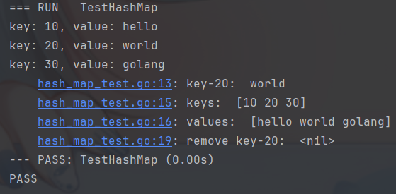
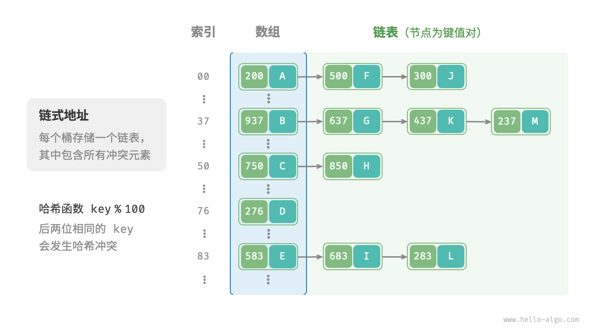
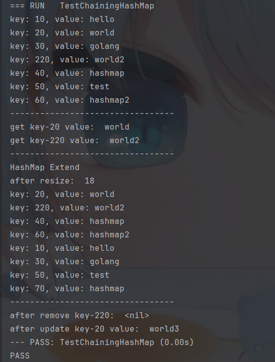

# 数据结构-哈希表

## 哈希表的定义

哈希表（Hash table，也叫哈希映射），是根据键（Key）而直接访问在内存存储位置的数据结构。也就是说，它通过计算一个关于键值的函数，将所需查询的数据映射到表中一个位置来访问记录，这加快了查找速度。这个映射函数称做哈希函数，存放记录的数组称做哈希表。

## 哈希表的数组实现

我们先仅用一个数组来模拟哈希表.在哈希表中,我们将数组中的每个元素位置称为**桶(bucket**),每个桶可以存放一个**键值对**.查询就是找到key对应的桶,然后返回对应的value.

如何基于key定位桶呢?这就是 **哈希函数(hash function)** 要做的事.哈希函数将key转换为数组下标,然后将key-value对存放在对应的桶中.换句话说，输入一个 key ，我们可以通过哈希函数得到该 key 对应的键值对在数组中的存储位置。

通常,输入一个key,哈希函数的计算过程如下:
* 1.通过某种哈希算法 `hash()` (常见的哈希算法有:`MD5,SHA-1,SHA-2,SHA-3`)计算得出哈希值.

* 2.将哈希值对桶的数量(数组的长度) `capacity` 取模,得到哈希值对应的数组下标 `index`.

即:
  `index = hash(key) % capacity`

假如数组的长度 `capacity` 为100, 哈希算法`hash(key) = key`, 那么它的哈希函数就为 `index = key % 100`,下图展示了哈希函数的工作原理


### 哈希表的结构实现

```go
// pair 将键值对封装为pair结构体
type pair struct {
	key   int
	value any
}

// ArrayHashMap 使用数组实现哈希表
type ArrayHashMap struct {
	buckets []*pair
}
```

### 哈希表的初始化

```go
// NewArrayHashMap 初始化哈希表
func NewArrayHashMap() *ArrayHashMap {
	// 初始化桶, 默认100个桶
	buckets := make([]*pair, 100)
	return &ArrayHashMap{buckets: buckets}
}
```

### 哈希函数实现

```go
// hashFunc 实现哈希函数
func (h *ArrayHashMap) hashFunc(key int) int {
	return key % 100
}
```

### 哈希表的常规操作

```go
// put 向哈希表中插入键值对
func (h *ArrayHashMap) put(key int, value any) {
	// 1. 计算哈希值 得出桶的索引
	index := h.hashFunc(key)
	// 2. 将键值对插入到索引对应的桶中
	h.buckets[index] = &pair{key: key, value: value}
}

// get 从哈希表中获取键对应的值
func (h *ArrayHashMap) get(key int) any {
	// 1. 计算哈希值 得出桶的索引
	index := h.hashFunc(key)
	// 2. 从索引对应的桶中获取值
	// 如果桶为空，则返回nil
	if h.buckets[index] != nil {
		return h.buckets[index].value
	}
	return nil
}

// remove 从哈希表中删除键值对
func (h *ArrayHashMap) remove(key int) {
	// 1. 计算哈希值 得出桶的索引
	index := h.hashFunc(key)
	// 2. 将索引对应的桶置为nil
	h.buckets[index] = nil
}

// keys 获取所有的键
func (h *ArrayHashMap) keys() []int {
	var keys []int
	// 遍历所有的桶
	for _, bucket := range h.buckets {
		// 如果桶不为空，则将键添加到keys中
		if bucket != nil {
			keys = append(keys, bucket.key)
		}
	}
	return keys
}

// values 获取所有的值
func (h *ArrayHashMap) values() []any {
	var values []any
	// 遍历所有的桶
	for _, bucket := range h.buckets {
		// 如果桶不为空，则将值添加到values中
		if bucket != nil {
			values = append(values, bucket.value)
		}
	}
	return values
}

// pairs 获取所有的键值对
func (h *ArrayHashMap) pairs() []*pair {
	var pairs []*pair
	// 遍历所有的桶
	for _, bucket := range h.buckets {
		// 如果桶不为空，则将键值对添加到pairs中
		if bucket != nil {
			pairs = append(pairs, bucket)
		}
	}
	return pairs
}

// print 打印哈希表
func (h *ArrayHashMap) print() {
	for _, bucket := range h.buckets {
		if bucket != nil {
			fmt.Printf("key: %d, value: %v\n", bucket.key, bucket.value)
		}
	}
}
```

### 测试函数示例

```go
package hashmap

import "testing"

func TestHashMap(t *testing.T) {
	hashMap := NewArrayHashMap()
	hashMap.put(10, "hello")
	hashMap.put(20, "world")
	hashMap.put(30, "golang")

	hashMap.print()

	t.Log("key-20: ", hashMap.get(20))

	t.Log("keys: ", hashMap.keys())
	t.Log("values: ", hashMap.values())

	hashMap.remove(20)
	t.Log("after remove key-20: ", hashMap.get(20))

}
```

### 测试结果示例



## 哈希冲突与扩容

### 哈希冲突

从本质上看，哈希函数的作用是将所有 key 构成的输入空间映射到数组所有索引构成的输出空间，而输入空间往往远大于输出空间。因此，**理论上一定存在“多个输入对应相同输出”的情况**。

在上述示例中,假如插入的key为`120`时，经过哈希函数计算后，得到的索引为`20`，而数组中索引为`20`的位置已经被**占用**了。此时，我们称`120`和`20`发生了**哈希冲突（hash collision）**。

### 扩容

容易想到，哈希表容量越大，多个 key 被分配到同一个桶中的概率就越低，冲突就越少。因此，我们可以通过**扩容**哈希表来减少哈希冲突。

例如将上述哈希表扩容为原来的两倍,即`capacity=200`, 哈希函数为`index = key % 200`, 至此,上述的哈希冲突问题得到解决。

类似于数组扩容，哈希表扩容需将所有键值对从原哈希表迁移至新哈希表，非常耗时；并且由于哈希表容量 capacity 改变，我们需要通过哈希函数来重新计算所有键值对的存储位置，这进一步增加了扩容过程的计算开销。为此，编程语言通常会预留足够大的哈希表容量，防止频繁扩容。

### 负载因子

**负载因子（load factor）**是哈希表的一个重要概念，其定义为哈希表的元素数量除以桶数量，用于衡量哈希冲突的严重程度，也常作为哈希表扩容的触发条件。例如在 Java 中，当负载因子超过
时，系统会将哈希表扩容至原先的**2**倍。

----

上面我们提到,通常情况下哈希函数的输入空间远大于输出空间，因此理论上哈希冲突是不可避免的。使用扩容解决哈希冲突虽然简单粗暴有效,但同时也带来了性能和空间上的开销。

为了提升效率，我们可以采用以下策略。

* 1.改良哈希表数据结构，使得哈希表可以在出现哈希冲突时正常工作。
* 2.仅在必要时，即当哈希冲突比较严重时，才执行扩容操作。

因此哈希表的结构改良方法主要包括 **“链式地址”** 和 **“开放寻址”**。

## 哈希表的链式地址实现

在原始哈希表中，每个桶仅能存储一个键值对。链式地址（separate chaining）将单个元素转换为**链表**，将键值对作为链表节点，将所有发生冲突的键值对都存储在同一链表中。下图展示了一个链式地址哈希表的例子。



基于链式地址实现的哈希表的操作方法发生了以下变化。

* 查询元素：输入 key ，经过哈希函数得到**桶索引**，即可访问链表头节点，然后**遍历**链表并对比 key 以查找目标键值对。
* 添加元素：首先通过哈希函数访问链表头节点，然后将节点（键值对）添加到链表中。
* 删除元素：根据哈希函数的结果访问链表头部，接着遍历链表以查找目标节点并将其删除。

链式地址存在以下局限性。

* 占用空间增大：链表包含节点指针，它相比数组更加耗费内存空间。
* 查询效率降低：因为需要线性遍历链表来查找对应元素。

###  哈希表的结构实现
```go
// pair 键值对
type pair struct {
	key int
	value any
}

type ChainingHashMap struct {
	buckets       []*list.List // 桶
	size          int          // 当前哈希表中的元素个数
	capacity      int          // 哈希表容量
	loadThreshold float64      // 负载因子
	extendRatio   int          // 扩容因子(扩容时桶的个数变为原先的extendRatio倍)
}
```

### 哈希表的初始化

```go
// NewChainingHashMap 创建一个链式地址哈希表
func NewChainingHashMap() *ChainingHashMap {
	// 初始一个默认桶大小为9, 负载因子为2/3, 扩容因子为2的哈希表
	return &ChainingHashMap{
		buckets:       make([]*list.List, 9),
		size:          0,
		capacity:      9,
		loadThreshold: 2.0 / 3.0,
		extendRatio:   2,
	}
}
```

### 哈希函数实现

```go
// hashFunc 哈希函数
func (h *ChainingHashMap) hashFunc(key int) int {
	return key % h.capacity
}
```

### 计算负载因子

```go
// loadFactor 计算负载因子
func (h *ChainingHashMap) loadFactor() float64 {
	return float64(h.size) / float64(h.capacity)
}
```

### 扩容实现

```go
// extend 扩容
func (h *ChainingHashMap) extend() {
	// 1.计算扩容后的容量
	h.capacity *= h.extendRatio
	// 2.创建新的桶列表
	newBuckets := make([]*list.List, h.capacity)
	// 3.将旧桶中的元素迁移到新桶中
	for _, bucket := range h.buckets {
		if bucket != nil {
			for e := bucket.Front(); e != nil; e = e.Next() {
				// 遍历每个桶中的键值对,重新计算新的索引
				newIndex := h.hashFunc(e.Value.(*pair).key)
				if newBuckets[newIndex] == nil {
					newList := list.New()
					newList.PushBack(e.Value)
					newBuckets[newIndex] = newList
				} else {
					newBuckets[newIndex].PushBack(e.Value)
				}
			}
		}
	}
	// 4.更新桶列表
	h.buckets = newBuckets
}
```

### 哈希表的常规操作

```go
// put 插入元素
func (h *ChainingHashMap) put(key int, value any) {
	// 负载因子超过阈值，进行扩容
	if h.loadFactor() > h.loadThreshold {
		fmt.Println("HashMap Extend")
		h.extend()
	}
	index := h.hashFunc(key)

	if h.buckets[index] == nil {
		// 如果桶为空，则新建一个桶
		newList := list.New()
		newList.PushBack(&pair{
			key:   key,
			value: value,
		})
		h.buckets[index] = newList
		// 更新长度
		h.size++
	} else {
		// 如果桶不为空，则遍历桶中的元素，如果存在相同的key，则更新value，否则插入新元素
		for e := h.buckets[index].Front(); e != nil; e = e.Next() {
			if e.Value.(*pair).key == key { // 找到相同的key，更新value
				e.Value.(*pair).value = value
				return

			}
		}
		// 没有找到相同的key，插入新元素
		h.buckets[index].PushBack(&pair{
			key:   key,
			value: value,
		})
		h.size++
	}
}

// get 获取元素
func (h *ChainingHashMap) get(key int) any {
	// 1.计算索引
	index := h.hashFunc(key)
	// 2.遍历桶中的元素，找到key对应的value
	if h.buckets[index] != nil {
		for e := h.buckets[index].Front(); e != nil; e = e.Next() {
			if e.Value.(*pair).key == key {
				return e.Value.(*pair).value
			}
		}
	}
	return nil
}

// remove 删除元素
func (h *ChainingHashMap) remove(key int) {
	// 1.计算索引
	index := h.hashFunc(key)
	// 2.遍历桶中的元素，找到key对应的value，并删除
	if h.buckets[index] != nil {
		for e := h.buckets[index].Front(); e != nil; e = e.Next() {
			if e.Value.(*pair).key == key {
				h.buckets[index].Remove(e)
				h.size--
				return
			}
		}
	}
}

// print 打印哈希表
func (h *ChainingHashMap) print() {
	for _, bucket := range h.buckets {
		if bucket != nil {
			for e := bucket.Front(); e != nil; e = e.Next() {
				fmt.Printf("key: %d, value: %v\n", e.Value.(*pair).key, e.Value.(*pair).value)
			}
		}
	}
}
```

### 测试函数示例
```go
package hashmap

import (
	"fmt"
	"testing"
)

func TestChainingHashMap(t *testing.T) {
	hashMap := NewChainingHashMap()
	hashMap.put(10, "hello")
	hashMap.put(20, "world")
	hashMap.put(220, "world2")
	hashMap.put(30, "golang")
	hashMap.put(40, "hashmap")
	hashMap.put(50, "test")
	hashMap.put(60, "hashmap2")
	hashMap.print()
	fmt.Println("---------------------------------")

	fmt.Println("get key-20 value: ", hashMap.get(20))
	fmt.Println("get key-220 value: ", hashMap.get(220))
	fmt.Println("---------------------------------")

	// 此时负载因子达到7/9, 超过了2/3阈值,触发扩容
	hashMap.put(70, "hashmap")
	fmt.Println("after resize: ", hashMap.capacity)
	hashMap.print()
	fmt.Println("---------------------------------")

	hashMap.remove(220)
	fmt.Println("after remove key-220: ", hashMap.get(220))

	hashMap.put(20, "world3")
	fmt.Println("after update key-20 value: ", hashMap.get(20))
}
```

###  测试结果示例



## 开放寻址

开放寻址(Open Addressing),不引入额外的数据结构,通过"多次探测"来解决冲突.

### 线性探测

线性探测采用固定步长的线性搜索来进行探测，其操作方法与普通哈希表有所不同。

* **插入元素**：通过哈希函数计算桶索引，若发现桶内已有元素，则从冲突位置**向后线性遍历**（步长通常为
），直至找到空桶，将元素插入其中。
* **查找元素**：若发现哈希冲突，则使用相同步长向后进行线性遍历，直到找到对应元素，返回 value 即可；如果遇到空桶，说明目标元素不在哈希表中，返回 None 。

值得注意的是，我们不能在开放寻址哈希表中直接删除元素。这是因为删除元素会在数组内产生一个空桶 None ，而当查询元素时，线性探测到该空桶就会返回，因此在该空桶之下的元素都无法再被访问到.

### 平方探测

平方探测与线性探测类似，都是开放寻址的常见策略之一。当发生冲突时，平方探测不是简单地跳过一个固定的步数，而是跳过“探测次数的平方”的步数，即
`1,4,9,...`步。

平方探测主要具有以下优势。

* 平方探测通过跳过探测次数平方的距离，试图缓解线性探测的聚集效应。
* 平方探测会跳过更大的距离来寻找空位置，有助于数据分布得更加均匀。 

然而，平方探测并不是完美的。

* 仍然存在聚集现象，即某些位置比其他位置更容易被占用。
* 由于平方的增长，平方探测可能不会探测整个哈希表，这意味着即使哈希表中有空桶，平方探测也可能无法访问到它。

### 多次哈希
顾名思义，多次哈希方法使用多个哈希函数进行探测。

* 插入元素：若哈希函数`f1(x)`出现冲突，则尝试`f2(x)`，以此类推，直到找到空位后插入元素。

* 查找元素：在相同的哈希函数顺序下进行查找，直到找到目标元素时返回；若遇到空位或已尝试所有哈希函数，说明哈希表中不存在该元素，则返回 None 。
与线性探测相比，多次哈希方法不易产生聚集，但多个哈希函数会带来**额外的计算量**。
