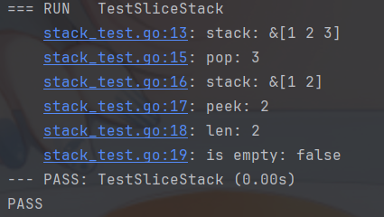

# 数据结构-栈

## 栈的定义

栈（stack）是限定仅在表尾进行插入和删除操作的线性表,一种遵循**先入后出**逻辑的线性数据结构。

本文将使用go语言,从切片以及链表两种方式实现栈(推荐使用切片来模拟栈)。

## 栈的结构定义

:::code-group
```go [slice]
// Stack 栈
type Stack []int
```

```go [linked list]
// Stack 栈
type Stack struct {
	*list.List // 务必注意嵌入的是指针类型
}
```
:::

### 栈的初始化

:::code-group
```go [slice]
// NewStack 创建一个栈
// Returns:
// - *Stack: 栈指针
func NewStack() *Stack {
	return &Stack{}
}
```

```go [linked list]
// NewStack 创建一个栈
// Return
// - *Stack 栈指针
func NewStack() *Stack {
	return &Stack{List: list.New()}
}
```
:::

## 栈的常用操作

### 入栈

:::code-group
```go [slice]
// push 入栈
// Params:
// - v: 入栈元素
func (s *Stack) push(v int) {
	*s = append(*s, v) // 将v添加到切片的末尾
}
```

```go [linked list]
// push 入栈
// Params:
// - v 入栈元素
func (s *Stack) push(v interface{}) {
	s.List.PushBack(v)
}
```

:::

### 出栈

:::code-group
```go [slice]
// pop 出栈
// Returns:
// - int: 出栈元素
func (s *Stack) pop() int {
	if len(*s) == 0 {
		return -1
	}
	v := (*s)[len(*s)-1]  // 获取切片的最后一个元素
	*s = (*s)[:len(*s)-1] // 切片截断,删除最后一个元素
	return v
}
```


```go [linked list]
// pop 出栈
// Return:
// - any 出栈元素
func (s *Stack) pop() any {
	return s.List.Remove(s.Back())
}
```

:::

### 获取栈顶元素

:::code-group
```go [slice]
// peek 获取栈顶元素
func (s *Stack) peek() int {
	if len(*s) == 0 {
		return -1
	}
	return (*s)[len(*s)-1]
}
```

```go [linked list]
// peek 查看栈顶元素
// Return:
// - any 栈顶元素
func (s *Stack) peek() any {
	return s.List.Back().Value
}
```

:::

### 判断栈是否为空

:::code-group
```go [slice]
// isEmpty 判断栈是否为空
func (s *Stack) isEmpty() bool {
	return len(*s) == 0
}
```

```go [linked list]
// isEmpty 栈是否为空
// Return:
// - bool 是否为空
func (s *Stack) isEmpty() bool {
	return s.List.Len() == 0
}
```
:::

### 获取栈的大小

:::code-group
```go [slice]
// len 获取栈长度
func (s *Stack) len() int {
	return len(*s)
}
```

```go [linked list]
// len 栈大小
// Return:
// - int 栈大小
func (s *Stack) len() int {
	return s.List.Len()
}
```
:::

## 测试函数示例代码

:::code-group
```go [slice]
package slice

import (
	"testing"
)

func TestSliceStack(t *testing.T) {
	stack := NewStack()
	stack.push(1)
	stack.push(2)
	stack.push(3)

	t.Log("stack:", stack)

	t.Log("pop:", stack.pop())
	t.Log("stack:", stack)
	t.Log("peek:", stack.peek())
	t.Log("len:", stack.len())
	t.Log("is empty:", stack.isEmpty())
}
```

```go [linked list]
package linked_list

import "testing"

func TestLinkedListStack(t *testing.T) {
	stack := NewStack()
	stack.push(1)
	stack.push(2)
	stack.push(3)

	t.Log("stack:")
	stack.print()

	t.Log("pop:", stack.pop())
	t.Log("stack:")
	stack.print()
	t.Log("peek:", stack.peek())
	t.Log("len:", stack.len())
	t.Log("is empty:", stack.isEmpty())
}
```
:::

## 测试结果

