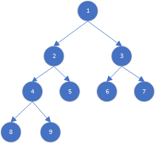
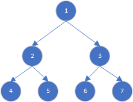
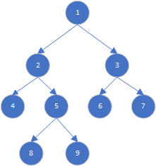

#  数据结构-树

二叉树（binary tree）是一种非线性数据结构，代表“祖先”与“后代”之间的派生关系，体现了“一分为二”的分治逻辑.

```go
// TreeNode 二叉树节点结构
type TreeNode struct {
	Val   int
	Left  *TreeNode
	Right *TreeNode
}

// NewTreeNode 创建二叉树节点
func NewTreeNode(val int) *TreeNode {
	return &TreeNode{
		Val: val,
		Left: nil,
		Right: nil,
	}
}
```
每个节点都有两个引用（指针），分别指向左子节点（left-child node）和右子节点（right-child node），该节点被称为这两个子节点的父节点（parent node）。当给定一个二叉树的节点时，我们将该节点的左子节点及其以下节点形成的树称为该节点的左子树（left subtree），同理可得右子树（right subtree）。

## 二叉树的专业术语

- 根节点（root node）: 没有父节点的节点,树的顶层节点
- 叶子节点（leaf node）: 没有子节点的节点
- 边（edge）: 连接两个节点的线段(引用)称为边
- 节点所在的层数（level）: 根节点所在的层数是1，以此类推
- 节点的度（degree）: 节点的子节点数量, 二叉树的节点的度的取值范围为[0, 1, 2]
- 节点的深度（depth）: 根节点到该节点的边的数量
- 节点的高度（height）: 该节点到最远叶子节点的边的数量
- 二叉树的高度（height）: 根节点的高度,即根节点到最远叶子节点的边的数量




如在上图所示的二叉树中,
* 根节点为`节点1`
* 叶子节点为`节点5`,`节点6`,`节点7`,`节点8`,`节点9`
* 总共有`8`条边
* `节点2`所在的层数为2
* `节点2`的度为2
* `节点2`的深度为1
* `节点2`的高度为2
* 二叉树的高度为3

## 二叉树的分类

### 完美二叉树(满二叉树)



完美二叉树（perfect binary tree）所有层的节点都被完全填满。在完美二叉树中，叶节点的度为`0`，其余所有节点的度都为 `2`；若树的高度为`h`，则节点总数为 
$$
2^{(h+1)}-1
$$
 ，呈现标准的指数级关系

### 完全二叉树


完全二叉树（complete binary tree）是除了最底层节点可能没填满外，其余每层节点都被完全填满，并且最后一层节点都靠左排列.

### 完满二叉树



完满二叉树（full binary tree）除了叶节点之外，其余所有节点都有两个子节点。

### 平衡二叉树


平衡二叉树（balanced binary tree）中任意节点的左子树和右子树的高度之差的绝对值不超过 1 。

## 二叉树的遍历

### 层序遍历

层序遍历（level-order traversal）从*顶部到底部逐层遍历二叉树*，并在每一层按照*从左到右*的顺序访问节点。

层序遍历本质上属于广度优先遍历（breadth-first traversal），也称广度优先搜索（breadth-first search, BFS），它体现了一种“一圈一圈向外扩展”的逐层遍历方式。

广度优先遍历通常借助“**队列**”来实现。队列遵循“先进先出”的规则，而广度优先遍历则遵循“逐层推进”的规则，两者背后的思想是一致的。实现代码如下：

```go
// LevelOrder 层序遍历,通常使用队列实现
func LevelOrder(root *TreeNode) []any {
	// 用来保存遍历结果的切片
	result := make([]any, 0)
	// 初始化一个队列
	queue := list.New()
	// 根节点入队
	queue.PushBack(root)
	// 当队列不为空时
	for queue.Len() > 0 {
		// 出队
		node := queue.Remove(queue.Front()).(*TreeNode)
		// 如果左节点不为空，入队
		if node.Left != nil {
			queue.PushBack(node.Left)
		}
		// 如果右节点不为空，入队
		if node.Right != nil {
			queue.PushBack(node.Right)
		}
		// 将节点值加入结果切片
		result = append(result, node.Val)
	}
	return result
}
```

## 前序, 中序, 后序遍历

前序、中序和后序遍历都属于**深度优先遍历**（depth-first traversal），也称**深度优先搜索**（depth-first search, DFS），它体现了一种“先走到尽头，再回溯继续”的遍历方式。

前序遍历是指根节点在前，中序遍历是指根节点在中，后序遍历是指根节点在后。

深度优先遍历通产基于递归实现.

```go
// PreOrder 先序遍历
func PreOrder(root *TreeNode, result *[]any) {
	if root != nil {
		// 访问优先级：根节点 -> 左子树 -> 右子树
		*result = append(*result, root.Val)
		PreOrder(root.Left, result)
		PreOrder(root.Right, result)
	}
}

// InOrder 中序遍历
func InOrder(root *TreeNode, result *[]any) {
	if root != nil {
		// 访问优先级：左子树 -> 根节点 -> 右子树
		InOrder(root.Left, result)
		*result = append(*result, root.Val)
		InOrder(root.Right, result)
	}
}

// PostOrder 后序遍历
func PostOrder(root *TreeNode, result *[]any) {
	// 访问优先级：左子树 -> 右子树 -> 根节点
	if root != nil {
		PostOrder(root.Left, result)
		PostOrder(root.Right, result)
		*result = append(*result, root.Val)
	}
}
```

## 二叉搜索树

二叉搜索树（Binary Search Tree，简称BST, 也叫二叉排序树）是指一棵空树或者具有下列性质的二叉树：

* 1.对于根节点，左子树中所有节点的值 `<` 根节点的值 `<` 右子树中所有节点的值。
* 2.任意节点的左、右子树也是二叉搜索树，即同样满足条件 1 。


### 二叉搜索树的操作

我们将二叉搜索树封装为一个结构体 `BinarySearchTree` ，并声明一个成员变量 root ，指向树的根节点。

### 查找节点

给定目标节点值 num ，可以根据二叉搜索树的性质来查找。我们声明一个节点 cur ，从二叉树的根节点 root 出发，循环比较节点值 cur.val 和 num 之间的大小关系。

- 若 cur.val < num ，说明目标节点在 cur 的右子树中，因此执行 cur = cur.right 。
- 若 cur.val > num ，说明目标节点在 cur 的左子树中，因此执行 cur = cur.left 。
- 若 cur.val = num ，说明找到目标节点，跳出循环并返回该节点。


```go
type BinarySearchTree struct {
	root *TreeNode
}

func NewBinarySearchTree(root *TreeNode) *BinarySearchTree {
	return &BinarySearchTree{root: root}
}
```

:::code-group
```go [迭代]
// searchByIteration 迭代实现查找
func (bst *BinarySearchTree) searchByIteration(val int) *TreeNode {
	cur := bst.root
	// 遍历节点
	for cur != nil {
		if cur.Val == val {
			return cur
		}
		// 小于则向左查找
		if cur.Val < val {
			cur = cur.Right
		} else {
			// 大于则向右查找
			cur = cur.Left
		}
	}
	return nil
}
```
```go [递归]
// searchByRecursion 递归实现查找
func (bst *BinarySearchTree) searchByRecursion(val int) *TreeNode {
	if bst.root != nil {
		if bst.root.Val == val {
			return bst.root
		}
		// 小于则将右树放入递归查找
		if bst.root.Val < val {
			return NewBinarySearchTree(bst.root.Right).searchByRecursion(val)
		} else {
			// 大于则将左树放入递归查找
			return NewBinarySearchTree(bst.root.Left).searchByRecursion(val)
		}
	}
	return nil
}
```
:::

### 测试函数示例

```go
func TestBST(t *testing.T) {
	// 构造一个二叉搜索树
	n1 := NewTreeNode(1)
	n2 := NewTreeNode(2)
	n3 := NewTreeNode(3)
	n4 := NewTreeNode(4)
	n5 := NewTreeNode(5)
	n6 := NewTreeNode(6)
	n7 := NewTreeNode(7)
	n8 := NewTreeNode(8)
	n9 := NewTreeNode(9)
	n10 := NewTreeNode(10)
	n11 := NewTreeNode(11)
	n12 := NewTreeNode(12)
	n13 := NewTreeNode(13)
	n14 := NewTreeNode(14)
	n15 := NewTreeNode(15)

	n8.Left = n4
	n8.Right = n12
	n4.Left = n2
	n4.Right = n6
	n2.Left = n1
	n2.Right = n3
	n6.Left = n5
	n6.Right = n7
	n12.Left = n10
	n12.Right = n14
	n10.Left = n9
	n10.Right = n11
	n14.Left = n13
	n14.Right = n15

	bst := NewBinarySearchTree(n8)
	inOrderResult := make([]any, 0)
	InOrder(bst.root, &inOrderResult)
	fmt.Println("中序遍历: ", inOrderResult)

	fmt.Println("迭代查找节点: ", bst.searchByIteration(10).Val)
	fmt.Println("递归查找节点: ", bst.searchByRecursion(10).Val)
}
```
输出结果:
```text
中序遍历:  [1 2 3 4 5 6 7 8 9 10 11 12 13 14 15]
迭代查找节点:  10
递归查找节点:  10
```

### 插入节点

插入节点的流程如下:

* 1.查找插入位置：与查找操作相似，从根节点出发，根据当前节点值和 num 的大小关系循环向下搜索，直到越过叶节点（遍历至 None ）时跳出循环。
* 2.在该位置插入节点：初始化节点 num ，将该节点置于 None 的位置。

```go
// insert 插入节点
func (bst *BinarySearchTree) insert(val int) {
	cur := bst.root
	// 如果根节点为空，则直接插入
	if cur == nil {
		bst.root = NewTreeNode(val)
		return
	}
	// 记录待插入节点的前置节点
	var pre *TreeNode = nil
	// 按照查询的规则找到插入的位置
	for cur != nil {
		// 节点已存在,直接返回
		if cur.Val == val {
			return
		}
		// 保存前置节点
		pre = cur
		if cur.Val < val {
			// 向右查找
			cur = cur.Right
		} else {
			// 向左查找
			cur = cur.Left
		}
	}
	// 此时cur为nil，pre为待插入节点的前置节点
	newNode := NewTreeNode(val)
	if pre == nil {
		panic("pre is nil")
	}
	// 根据val与pre.Val的大小关系，决定插入到pre的左子树还是右子树
	if pre.Val < val {
		pre.Right = newNode
	} else {
		pre.Left = newNode
	}
}
```

###  删除节点

删除节点的流程如下:

* 1.查找删除节点：与查找操作相似，从根节点出发，根据当前节点值和 num 的大小关系循环向下搜索，直到越过叶节点（遍历至 None ）时跳出循环。
* 2.删除节点：
  * 如果待删除节点为叶节点，则直接删除。
  * 如果待删除节点只有一个子节点，则用子节点代替。
  * 如果待删除节点有两个子节点，则用后继节点代替。由于要保持二叉搜索树“左子树<根节点<右子树”的性质，因此这个节点可以是**右子树的最小节点**或**左子树的最大节点**。

```go
// remove 删除节点
func (bst *BinarySearchTree) remove(val int) {
	cur := bst.root
	// 若树为空，直接提前返回
	if cur == nil {
		return
	}
	// 待删除节点之前的节点位置
	var pre *TreeNode = nil
	// 循环查找，越过叶节点后跳出
	for cur != nil {
		if cur.Val == val {
			break
		}
		pre = cur
		if cur.Val < val {
			// 待删除节点在右子树中
			cur = cur.Right
		} else {
			// 待删除节点在左子树中
			cur = cur.Left
		}
	}
	// 若找不到删除节点，提前返回
	if cur == nil {
		return
	}
	// 根据节点的子节点数量分为3种情况删除
	// 子节点数为 0 或 1
	if cur.Left == nil || cur.Right == nil {
		var child *TreeNode = nil
		// 取出待删除节点的子节点
		if cur.Left != nil {
			child = cur.Left
		} else {
			child = cur.Right
		}
		// 删除节点 cur
		if cur != bst.root {
			if pre.Left == cur {
				pre.Left = child
			} else {
				pre.Right = child
			}
		} else {
			// 若删除节点为根节点，则重新指定根节点
			bst.root = child
		}
		// 子节点数为 2
	} else {
		// 获取中序遍历中待删除节点 cur 的下一个节点
		tmp := cur.Right
		for tmp.Left != nil {
			tmp = tmp.Left
		}
		// 递归删除节点 tmp
		bst.remove(tmp.Val)
		// 用 tmp 覆盖 cur
		cur.Val = tmp.Val
	}
}
```
