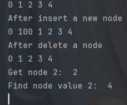

# 数据结构-链表

## 链表的定义

链表（linked list）是一种**线性**数据结构，其中的每个元素都是一个节点对象，各个节点通过**引用**相连接。引用记录了下一个节点的**内存地址**，通过它可以从当前节点访问到下一个节点。
链表的设计使得各个节点可以分散存储在内存各处，它们的内存地址无须连续。

## 链表的分类
* 单向链表：即本文重点介绍的普通链表。单向链表的节点包含值和指向下一节点的引用两项数据。首个节点称为头节点，将最后一个节点称为尾节点，尾节点指向空 `nil` 。
* 环形链表：令单向链表的尾节点指向头节点（首尾相接），则得到一个环形链表。在环形链表中，任意节点都可以视作头节点。
* 双向链表：与单向链表相比，双向链表记录了两个方向的引用。双向链表的节点定义同时包含指向后继节点（下一个节点）和前驱节点（上一个节点）的引用（指针）。相较于单向链表，双向链表更具灵活性，可以朝两个方向遍历链表，但相应地也需要占用更多的内存空间。

## 链表的结构定义

```go
// ListNode 链表节点结构体
type ListNode struct {
	Val  int       // 节点的值
	Next *ListNode // 指向下一个节点的指针
}
```

### 初始化一个链表节点

```go
// NewListNode 创建一个新节点
// Params:
//   - val: 节点值
// Return:
//   - node: 链表节点
func NewListNode(val int) *ListNode {
	return &ListNode{Val: val, Next: nil}
}
```

###  初始化一个链表

```go
// NewLinkedList 创建一个新链表
// Params:
//   - size: 链表长度
// Return:
//   - headNode: 链表头节点
func NewLinkedList(size int) (headNode *ListNode) {
	headNode = nil // 头节点指针
	var currentNode *ListNode = nil // 当前节点指针
	// 前往后创建节点
	for i := 0; i < size; i++ {
		newNode := NewListNode(i) //  创建新节点
		if headNode == nil {
			headNode = newNode // 头节点为空则将头节点指向新节点
		}
		if currentNode == nil {
			currentNode = newNode //  当前节点为空则将当前节点指向新节点
		}
		currentNode.Next = newNode //  当前节点指向新节点
		currentNode = newNode // 
	}
	return headNode
}
```

## 链表的常用操作

### 打印(遍历)链表

```go
// Print 打印链表
func (l *ListNode) Print() {
	for l != nil { 
		fmt.Print(l.Val, " ")
		l = l.Next // 指针后移
	}
	fmt.Println()
}
```

### 插入新节点

```go
// InsertNode 在头节点后插入新节点
// Params:
//   - headNode: 链表头节点
//   - newNode: 新节点
func InsertNode(headNode *ListNode, newNode *ListNode) {
	newNode.Next = headNode.Next // 新节点的Next指向头节点的Next
	headNode.Next = newNode      // 头节点的Next指向新节点
}
```

### 删除节点

```go
// DeleteNode 删除头节点后的节点
// Params:
//   - headNode: 链表头节点
func DeleteNode(headNode *ListNode) {
	headNode.Next = headNode.Next.Next // 头节点的Next指向头节点的Next的Next
}
```

### 获取链表的第index个节点

```go
// GetNode 获取链表中的第index个节点
// Params:
//   - headNode: 链表头节点
//   - index: 节点索引
//
// Return:
//   - node: 节点
func GetNode(headNode *ListNode, index int) (node *ListNode) {
	currentNode := headNode
	for i := 0; i <= index; i++ {
		if i == index {
			return currentNode
		}
		currentNode = currentNode.Next
	}
	return nil
}
```

### 获取链表中第一个值为val的节点

```go
// FindNode 获取链表中第一个值为val的节点
// Params:
//   - headNode: 链表头节点
//   - val: 节点值
//
// Return:
//   - node: 节点
func FindNode(headNode *ListNode, val int) (node *ListNode) {
	currentNode := headNode
	for currentNode != nil {
		if currentNode.Val == val {
			return currentNode
		}
		currentNode = currentNode.Next
	}
	return nil
}
```

### 主函数示例代码

```go
func main() {
	linkedList := NewLinkedList(5)
	linkedList.Print()

	newNode := NewListNode(100)
	InsertNode(linkedList, newNode)
	fmt.Println("After insert a new node")
	linkedList.Print()

	DeleteNode(linkedList)
	fmt.Println("After delete a node")
	linkedList.Print()

	fmt.Println("Get node 2: ", GetNode(linkedList, 2).Val)
	fmt.Println("Find node value==4: ", FindNode(linkedList, 4).Val)
}
```

运行结果:




## 双向链表示例

```go
/* 双向链表节点结构体 */
type DoublyListNode struct {
    Val  int             // 节点值
    Next *DoublyListNode // 指向后继节点的指针
    Prev *DoublyListNode // 指向前驱节点的指针
}

// NewDoublyListNode 初始化
func NewDoublyListNode(val int) *DoublyListNode {
    return &DoublyListNode{
        Val:  val,
        Next: nil,
        Prev: nil,
    }
}
```

其他操作大差不差，这里不再赘述。
