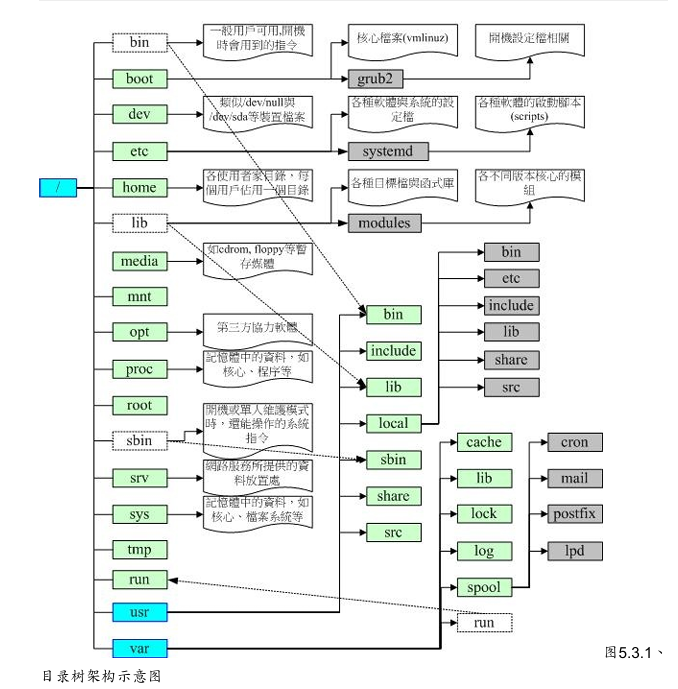
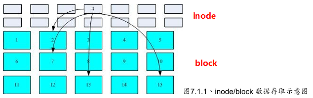

# Linux学习笔记

## 第三章 安装CentOS7.x

* Linux中镜像文件的写入
  
  ```sh
  dd if=centos7.iso of=/dev/sdc
  ```

  dd为一个用于文件复制与转换的指令，if为输入文件（input file）of为输出文件（output file）
  这条指令用于将centos7的镜像覆写到sdc设备中，覆写会抹除设备中原内容。

* 虚拟机的网络连接模式
  * NAT（网络地址转换）：虚拟机通过宿主机的IP访问外网，宿主机充当路由器给虚拟机分配一个私有IP
  * Bridged（桥接模式）：虚拟机直接连接到物理网络，虚拟机会从路由器获得一个独立的IP
  * Host-Only(仅主机模式)：虚拟机只能与宿主机进行通信，不能访问外网，如果有多个虚拟机，虚拟机之间可以相互通信

* Linux的显示服务器：显示服务器负责管理图形界面的底层渲染和输入输出，主要有两种
  * X.Org Server (X11): 传统，性能较老，但兼容性好，大多数发行版默认使用
  * Wayland：现代替代方案，更轻量，低延迟，主流发行版正逐步迁移至Wayland
  
* 常见的Linux的桌面环境
  * GNOME：现代化，简洁。显示服务器默认Wayland（可切换X11），资源占用较高
  * KDE Plasma：高度可定制，功能丰富。显示服务器默认X11，正逐步完善Wayland。资源占用中等
  * Xfce：轻量级，界面传统。显示服务器为X11。资源占用低

* Swap分区：它是Linux系统中的一种虚拟内存机制，它通过使用硬盘空间来扩展内存（RAM）一般为实体内存的1.5-2倍，类似于安卓系统中的内存扩展。当有数据被存放在实体内存里面，但是这些数据又不是常被CPU所取用时，那么这些不常被使用的程序将会被丢到硬盘的swap交换空间当中，而将速度较快的实体内存空间释放出来给真正需要的程序使用。 Swap分区可以防止因内存不足造成的系统崩溃，可以用于休眠功能的支持，当设备休眠时，系统会将RAM中的数据写入Swap分区，以便下次开机时恢复。如果没有Swap，休眠功能也就无法使用。使用 `free -h`可以查询当前的内存和Swap分区使用情况，其中的`-h`参数为将内存数据转化为易读的格式
  
* LVM（Logical Volume Manager）逻辑卷管理器：是Linux系统的一种高级磁盘管理技术，它允许将多个物理磁盘或者分区组合成逻辑卷
  * PV（Physical Volume）：物理卷，实际的磁盘或分区。好比于砖块
  * VG（Volume Group）：卷组，由多个PV组成，形成一个存储池，用于分配空间。好比于砖块砌成的墙
  * LV（Logical Volume）：逻辑卷，从VG中划分出来的逻辑分区，可直接格式化和挂载使用。好比于用墙围成的房间
  
## 第四章 首次登录与线上求助

* Linux默认的情况下会提供六个Terminal来让使用者登陆，切换的方式为使用：[Ctrl]+[Alt]+[F1]~[F6]的组合按钮。六个终端接口系统会分别命名为tty1-tty6
  
* sync指令：在Linux系统中，为了加快数据的读取速度，所以在默认的情况中，某些已经载入内存中的数据将不会直接被写回硬盘，而是先暂存在内存当中。但是万一系统因某些特殊情况造成不正常的关机，就会造成数据的更新不正常。输入sync，那么在内存中尚未被更新的数据，就会被写入硬盘中。一般用户使用sync只会保存自己的数据，而root用户可以保存所有数据。
* man page说明后面的数字中，1代表一般帐号可用指令，8代表系统管理员常用指令，5
代表系统配置文件格式；

## 第五章 Linux的文件权限与目录配置

* `ls`只会列出非隐藏文件名， `ls -al` 可以显示所有文件（包括`.`开头的隐藏文件）的详细信息，`ls -l`则会列出非隐藏文件的详细信息（等于`ll`），比如：`-rwxr-xr-- 1 root root 5 jul 9 16:58 test.c`第一栏的首位 `-` 代表它为文件，`d` 为目录，`l` 为链接文件 `b` 为设备文件中的可存储设备（如U盘），`c` 为设备文件中的外设（如键盘鼠标）
后9位以每3位未一组，分表代表**拥有者**，**群组**，**其他**的读(r)写(w)执行(x)权限
第二栏的数字代表有多少文件名硬链接到该节点：

  * 对于普通文件，新建文件时默认为1，因为只有该文件名指向该文件；每创建一个硬链接该数字就会加一
  * 对于目录,这个数字**至少为2**（目录本身+目录内的`.`条目（使用 `ls -al` 就能看到）），每有一个子目录，该数字就会加一（子目录中的`..`条目指向父目录）
  * 补充硬链接和软链接：
  
| 特性 | 硬链接 | 软链接 |
| ----- | ----- | ----- |
| 本质 | 同一个文件的另一个文件名 | 一个特殊文件，存储目标文件的路径（可以理解为win的快捷方式 |
|指向目录|通常不支持|支持|
|跨文件系统|不能跨不同磁盘或分区|可以跨磁盘或分区|
|删除原文件|硬链接仍然有效（直到所有硬链接被删除，可以理解为指针，修改指针的数据==修改原数据，数据没有指向它的指针时就会被回收）|软链接失效|
|修改影响|修改任一硬链接，所有硬链接**同步变化**|修改软链接本身**不影响原文件**|
|命令|`ln 源文件 硬链接名` | `ln -s 源文件 软链接名` |
|使用场景|需要多个路径访问同一文件，且不希望原文件删除后失效的情况|需要跨文件系统链接文件或目录、动态引用文件（版本切换，配置文件变更）|

第三栏和第四栏的`root`代表该文件的拥有者以及所属群组
第五栏为文件大小，单位为字节（Bytes）
第六栏为文件最后修改的日期
最后为文件名

* 修改文件权限：
  
  ```sh
  chmod [-R] xyz 文件或目录 // 使用数字更改权限
  chmod [-R] u=rwx,go=rx 文件或目录 // 使用符号更改权限（u, g, o, a）
  chmod [-R] a-x 文件或目录 // 使用+,-更改权限，这条指令表示所有人去掉执行权限
  ```

* 文件权限说明：

|元件|r|w|x|
|-----|-----|-----|-----|
|文件|读取文件内容|修改文件内容|执行文件内容|
|目录|读取该目录下的文件名数据（可使用ls）|修改文件夹下的内容|**进入该目录的权限**|

* Linux文件结构

```text
/bin        二进制文件，系统常规命令
/boot       系统启动分区，系统启动时读取的文件
/dev        设备文件
/etc        大多数配置文件
/home       普通用户的主目录
/lib        32位函数库
/lib64      64位库
/media      光盘、DVD等挂载点
/mnt        临时文件系统挂载点(U盘等)
/opt        第三方软件安装位置
/proc       进程信息及硬件信息
/root       超级用户主目录
/sbin       系统管理命令
/srv        网络服务需要取用的数据目录
/var        存放经常变化的文件(如日志)
/sys        内核相关信息
/tmp        临时文件
/usr        存放用户应用程序和文件(unix software resource)

/usr/bin    所有一般用户能够使用的指令
/usr/lib    与lib功能相同
/usr/local  系统管理员在本机自行安装和下载的软件
/usr/sbin   非系统正常运行所需要的系统指令
/usr/share  只读架构的数据文件和共享文件

/var/cache  应用产生的缓存
/var/lib    程序执行过程中产生的数据文件
/var/lock   程序产生的锁文件
/var/log    登录文件的放置目录
/var/mail   放置个人电子邮件的目录
/var/run    某些程序或服务启动后，会将他们的PID放置在这个目录下
/var/spool  放置排队等待其他程序使用的数据
```



## 第六章 Linux文件与目录管理

* 特殊目录符号：
  
  ```text
  .     // 代表当前目录
  ..    // 代表上层目录（父级目录）
  -     // 代表上一个目录
  ~     // 代表用户目录(cd ~ 与 cd 效果相同)
  ```

* `ls`常用参数
  
  ```sh
  -a    // 列出全部文件，连同隐藏文件
  -A    // 列出全部文件，但不包括 . 和 ..
  -d    // 只列出文件夹
  -h    // 将文件大小以人类较易读的方式列出
  -l    // 列出文件属性和权限等数据（ll）
  ```

* `cp`常用参数
  
  ```sh
  -a    // 等同-dr,（复制会改变文件的创建时间和拥有属性，加上该参数则会完全复制）
  -d    // 若源文件为链接文件，则复制链接文件属性而非文件本身
  -i    // 若目标文件已经存在，则在覆盖时会询问
  -r    // 递归复制，用于复制目录
  ```

* `basename` 和 `dirname`：`basename` 可以显示文件名称，`dirname` 可以显示文件的路径
  
  ```sh
  hycer@ubuntu:~/dir1$ basename /home/hycer/dir1/file1.txt
  file1.txt
  hycer@ubuntu:~/dir1$ dirname /home/hycer/dir1/file1.txt
  /home/hycer/dir1
  ```

* 文件内容查阅：
  * cat：从第一行开始显示
  * tac：从最后一行开始显示
  * **nl**：显示顺带输出行号
  * more：一页一页的显示文件内容
  * **less**：与more相似但是它可以往前翻
  * head：只看前面几行（-n参数指定具体行数）
  * **tail**：只看最后几行
  
* 文件的时间参数
  * modification time（**mtime**）：文件内容变更时的时间（*ls默认显示出来的时间*）
  * status time（**ctime**）：文件状态变更时的时间（权限，属性）
  * access time（atime）：文件被读取的时间

* touch修改文件时间
  
  ```sh
  touch -m [filename] // 修改文件的mtime为当前时间
  touch -t 202507141153 // 修改文件的mtime为2025/7/14/11：53

  touch -a [filename] // 修改文件的mtime为当前时间
  ```

* 文件默认权限：`umask`
  使用指令`umask`可查看新建文件或目录的默认权限分数

  ```sh
  hycer@ubuntu:~/dir1$ umask
  0002
  ```

  *注意：首位为**特殊权限**。权限分数为减掉的权限。如一个txt文件（没有执行权限）创建时的它的权限就为`666 - 002 = 664` 也就是其他人没有写入的权限，目录则为`777 - 002 = 775`*

  也可以使用 `-S` 参数用符号的方式展示权限

  ```sh
  hycer@ubuntu:~$ umask -S
  u=rwx,g=rwx,o=rx
  ```

* 文件隐藏属性
  * `chattr`设置隐藏属性：
  
    ```text
    chattr [+-=] [属性]

    +：加上属性
    -：减掉属性
    =：设置属性

    A：读取时间 atime 不会被修改
    S：文件的修改会同步写入磁盘（一般文件是非同步写入磁盘，参考上面的sync指令）
    a：只能增加数据，不嫩修改和删除，只有root能设置这个属性
    c：会将文件数据压缩后再写入磁盘（用于大文件且不频繁访问）
    d：不会被`dump`程序备份（dump是一个文件系统备份工具，支持全量和增量备份）
    i：不能被删除，改名，无法写入或新增数据，只有root能设置在属性
    s：被删除时无法恢复（永久删除）
    u：与s相反，删除时不会从磁盘中移除，可以恢复

    ```

  * `lsattr`查看隐藏属性

* 观察文件类型：使用`file`能显示某个文件的基本数据是ASCII，data还是二进制
  
  ```sh
  hycer@ubuntu:~/dir1$ file file1.txt 
  file1.txt: ASCII text
  ```

* 查找：
  * 使用`which`能显示命令存放的路径
  * 使用`whereis`可以查找命令的二进制，源码，手册的位置
  * 使用`find`能全盘搜索任意文件,支持名称，类型，时间，权限等参数（速度最慢）
  
    ```sh
    find [查找路径] -name [目标名称]

    hycer@ubuntu:~$ sudo find / -name .bashrc
    [sudo] password for hycer: 
    /etc/skel/.bashrc
    /snap/core22/2045/etc/skel/.bashrc
    /snap/core22/2045/root/.bashrc
    /snap/core22/2010/etc/skel/.bashrc
    /snap/core22/2010/root/.bashrc
    /root/.bashrc
    /home/hycer/.bashrc
    ```
  
  ## 第七章 Linux的磁盘和文件系统管理

* 文件系统特性：一个超级区块（superblock）记录整个文件系统的整体信息，数据的信息（如权限，属性）会被放在inode种，实际的数据会被存放在datablock里面,这种也叫索引式文件系统，inode和block初始就会完成分配；可以使用指令`df`查看文件系统的整体磁盘使用量
  * superblock：记录文件系统的的整体信息，包括inode和block的总量，使用量，余量等。一般来说一个文件系统只会含有一个superblock，但会存在备份的情况
  * inode：记录文件属性和记录文件数据的block，一个文件使用一个inode
  * block：实际记录文件的内容，一个文件可能会使用多个block（使用ll 查看文件列表时，第一行会显示`total`的字样，其实就是该目录下所有数据占用的block数量）
  

* 区块对照表block bitmap：记录新增数据所需要的空block，删除文件后会释放block号码。inode bitmap与之同理

* 目录：创建一个目录时，文件系统会分配一个inode和至少一个block给这个目录（inode bitmap和block bitmap会找到没有使用的inode和block），inode用于记录该目录的相关权限和属性和它分配给它的block号码，而block则记录在这个目录下的**文件名**和该文件名占用的inode号码（所以inode不记录文件名而是在block中记录，这也是为什么在目录下新增，删除或修改文件名得有该目录的w权限），再将inode和block数据同步更新给inode bitmap 和block bitmap，再更新superblock

* 文件：创建一个文件时，文件系统会分配一个inode和对应大小的block数量给它（假如创建一个82k的文件，每个block大小为4k，则会给它分配21个block，但是**一个inode最多12个直接指向**，因此还要多一个inode存储block号码）

* 文件系统的运行：当系统载入一个文件到内存后，若这个文件没有被编辑，则这段数据会被置为干净的（clean），当用户编辑这个文件时，系统会将它置为脏数据，用户的改动全在内存中并不会写入磁盘，系统会不定时将数据写入磁盘（也可以用上面提到的sync指令手动写入磁盘）

* 硬链接和软链接：硬链接的实质就是新增一个文件名指向源文件的inode号码；软链接的实质是新增一个文件（新增一个inode），这个文件指向源文件的文件名（所以源文件重命名，删除后就无法它的软链接了）

* 使用`parted [设备路径] print`可以列出磁盘的分区表类型和分区信息
  
  ```sh
  hycer@ubuntu:~/dir1$ sudo parted /dev/sda print
  Model: QEMU QEMU HARDDISK (scsi)
  Disk /dev/sda: 21.5GB
  Sector size (logical/physical): 512B/512B
  Partition Table: gpt
  Disk Flags: 

  Number  Start   End     Size    File system  Name  Flags
  1      1049kB  1000MB  999MB   fat32              boot, esp
  2      1000MB  2879MB  1879MB  ext4
  3      2879MB  21.5GB  18.6GB
  ```

* 磁盘分区
  * 1.使用`lsblk`查看磁盘名
  * 2.用`parted`查看分区类型
  * 3.使用`gdisk`(gpt分区)或`fdisk`(mbr分区)来进行分区操作
  * 4.保存分区后使用`partprobe`更行分区表信息，或者直接重启
  
* 创建swap分区
  * 1.使用磁盘分区工具将swap分区划分出来（注意分区的类型要选择Linux swap，也就是GUID=8200）
  * 2.使用`mkswap [分区路径]`创建swap分区

* 磁盘格式化：`mkfs`指令，输入mkfs后接tab会列出支持创建的文件系统

* 挂载文件系统
  * 最好将文件系统挂载到一个空的目录下，因为挂载后会**隐藏**原目录的内容（并不会覆盖）
  * 使用`mount [设备路径] [挂载点]`挂载文件系统
  * 使用`umount [设备路径/挂载点]`解除挂载
  
## 第八章 文件与文件系统的压缩，打包与备份
