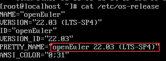
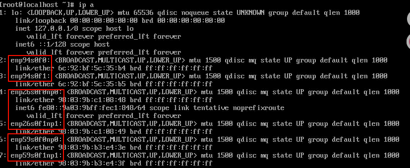
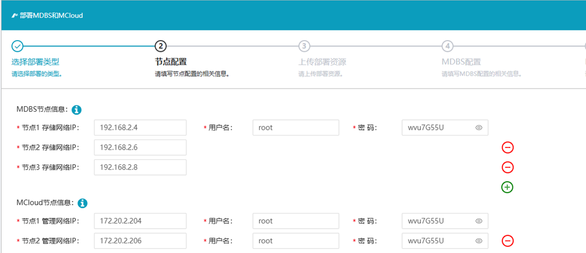
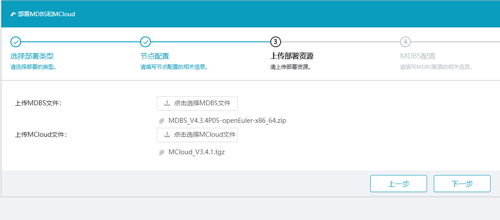
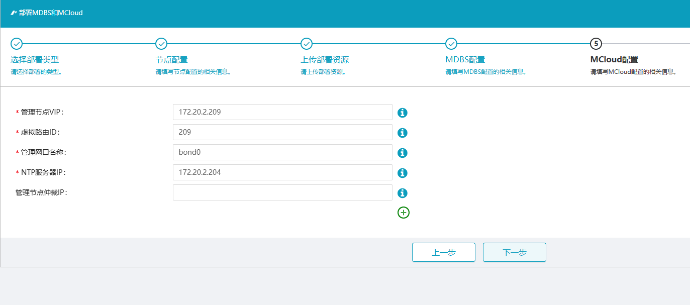

## 一.Deployer装机
1.使用U盘给3台浪潮服务器装机Deployer_V1.0.18,系统：Deployer-openEuler-22.03-LTS-SP4-x86_64.iso
2.检查系统版本：cat /etc/os-release

3.装机完成后检查网卡，所有服务器网卡名称应相同

其中enp94s为GE网卡做管理网，enp26s为10GE网卡做业务/迁移网，enp59s为25GE网卡做存储网

## 二.交换机侧配置

1.登录管理网交换机配置管理网端口聚合组
```shell
configure terminal # 进入全局配置模式
interface eth-0-10 # 进入网口配置模式
channel-group 10 mode active # 创建端口聚合组
exit
# ...其余两个网口配置方式相同

interface agg 10 # 进入端口聚合组配置模式
mlag 10 # 创建MLAG组
exit
# ... 剩余两个MLAG组配置方式相同
```
1.2交换机同理

2.登录业务网交换机配置业务网端口聚合组
```shell
configure terminal # 进入全局配置模式
interface eth-0-28 # 进入网口配置模式
switchport mode trunk # 设置端口 trunk
channel-group 28 mode active # 创建端口聚合组
exit
# ...其余两个网口配置方式相同

interface agg 28 # 进入端口聚合组配置模式
mlag 28 # 创建MLAG组
exit
# ... 剩余两个MLAG组配置方式相同
```
1.2交换机同理

3.登录存储网交换机配置存储网端口vlan，巨帧支持和聚合组
```shell
configure terminal # 进入全局配置模式

vlan 204 # 创建vlan 204

interface range eth-0-25 - 30 # 进入范围端口配置模式
switchport access vlan 204 # 将端口加入vlan 204
jumboframe enable # 允许巨帧
exit

interface eth-0-25 # 进入网口配置模式
channel-group 25 mode active # 创建端口聚合组
exit
interface eth-0-26 # 进入网口配置模式
channel-group 25 mode active
exit

interface eth-0-27 # 进入网口配置模式
channel-group 27 mode active # 创建端口聚合组
exit
interface eth-0-28 # 进入网口配置模式
channel-group 27 mode active
exit

interface eth-0-29 # 进入网口配置模式
channel-group 29 mode active # 创建端口聚合组
exit
interface eth-0-30 # 进入网口配置模式
channel-group 30 mode active
exit
```

## 三.服务器配置

1.检查系统版本（cat /etc/version),分区大小，磁盘数量
```shell
cat /etc/version
lsblk
```

2.执行网络初始化mc_first_config_network
```shell
mc_first_config_network
```

3.管理网配置bond0，并将管理网口加入bond0，配置管理网ip，网关和子网掩码
```shell
mc_bond_create_del -c bond0 # 创建bond0
mc_bond_add_del_nic -a bond0 enp94s0f0 # 添加管理网口
mc_bond_add_del_nic -a bond0 en94s0f1
# 其余两台服务器执行相同指令

# 每台服务器一个管理网ip，如：
mc_config_nic_and_bond_ip -i bond0 172.20.2.204 255.255.0.0 y 172.20.0.254 # 配置管理网ip

mc_config_nic_and_bond_ip -i bond0 172.20.2.206 255.255.0.0 y 172.20.0.254 # 配置管理网ip

mc_config_nic_and_bond_ip -i bond0 172.20.2.208 255.255.0.0 y 172.20.0.254 # 配置管理网ip
```


4.存储网配置bond2，并将存储网口加入bond2，配置存储网ip和子网掩码
```shell
mc_bond_create_del -c bond2 # 创建bond0
mc_bond_add_del_nic -a bond2 enp59s0f0np0 # 添加存储网口
mc_bond_add_del_nic -a bond2 enp59s0f1np1
# 其余两台服务器执行相同指令

# 每台服务器一个存储网ip，如：
mc_config_nic_and_bond_ip -i bond2 192.168.2.4 255.255.0.0 y 172.20.0.254 # 配置存储网ip

mc_config_nic_and_bond_ip -i bond2 192.168.2.6 255.255.0.0 y 172.20.0.254 # 配置存储网ip

mc_config_nic_and_bond_ip -i bond2 192.168.2.8 255.255.0.0 y 172.20.0.254 # 配置存储网ip
```

5.业务网配置bond1，并将业务网口加入bond1

6.迁移网复用业务网，配置迁移网ip和子网掩码


## 四.部署MCloud和MDBS







