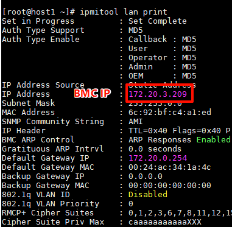

## 硬件组网及系统安装

以3台服务器，2台存储交换机，1台管理网交换机，1台业务网交换机

## 使用生产工具进行PXE装机

**确保生产工具所使用的网口已连接管理网（确保生产工具能通过BMC与物理机通信**

### 1.上传镜像

* 在镜像管理界面点击“添加”按钮上传系统镜像

### 2.创建应答文件

应答文件：用于自动配置装机模式和分区大小的配置文件

* 在应答文件管理界面点击“导入”导入应答文件（对能否自己创建不同参数的应答文件存疑）

### 3.添加主机

* 在主机管理界面，点击“添加”按钮，通过BMC IP，用户名、密码和厂商添加主机
* 添加失败时可以尝试将厂商切换为`other`
* BMC IP可以登录物理机使用`ipmitool lan print`查看
  
  
### 4.添加PXE源

* 在PXE源管理界面点击“添加”按钮，输入IP，用户名和密码添加PXE源

### 5.创建装机任务

* 在系统安装任务管理界面，点击"添加装机任务"，根据BMC IP选择目标机器，随后依次选择装机模式，系统镜像和应答文件，最后点击完成开始装机
* 注意：`other`类型的机器要取消勾选“是否检查BIOS”，而且`other`类型机器装机无法从pxe界面看到安装进度

## 存储交换机配置

### 1.配置vlan

进入全局配置模式`configure terminal`

* 创建vlan：`vlan <id>`
* 将端口划入vlan：`switchport mode access`,`switchport access vlan <id>`

### 2.添加端口聚合

* 创建端口聚合：
  * 进入网口：`interface <eth-x-xx>`
  * 添加端口聚合：`channel-group <聚合id> mode actice`
  
## 服务器配置

### 1.检查服务器配置

* 检查系统版本：`cat /etc/version`
* 检查系统盘分区和容量：`lsblk`
* 检查磁盘数量
* 检查网口配置

### 2.网络初始化

* 使用指令`mc_first_config_network`初始化网络（过程较慢可三个节点同时进行）
  
### 3.网络ip配置

* 根据指导书指令配置管理，存储，业务，迁移网络的bond和ip
* 注意存储网需要配置mtu(最大传输单元)`mc_change_nic_and_bond_mtu -i bond2 -m 9000`

### 4.主机名配置（按需）

使用指令`hostnamectl set-hostname node01-6`修改服务器主机名

### 5.时间配置

* 使用`date -R`检查时间时区（+0800）是否正确
* 使用`cp /usr/share/zoneinfo/Asia/Shanghai  /etc/localtime`修改时区
* 使用`date -s "20221216 17:55:00"`,`hwclock -w`修改时间
  
## MDBS&MCloud部署及初始配置

管理网口名称为管理网口组的bond名，如bond0

### MDBS初始配置

* 添加缓存盘时，可绑定的osd数量代表缓存盘的缓存分区数，默认为6，有几个数据盘就绑定几个osd

* 注意：缓存盘若为sata或者sas协议，需要将存储池属性中的并发任务数改为8。可使用指令`smartctl -i <硬盘路径> 查看硬盘参数`

* 存储类型：
  * 混合型：节点上同时存在SSD和HDD，SSD已创建缓存盘
  * 全闪型：节点上只有SSD

* 数据冗余保护机制：
  * 三副本：指一份数据写完全相同的三份副本，允许同时丢失两份数据；1/3表示只要有1份数据写入成功就返回写入成功，并且1个副本可读即可返回数据；2/3表示只要有2份数据写入成功就返回写入成功，并且2个副本可读才可返回数据
  * EC（纠删码）：将数据被分为m个数据块+n个校验块，最多丢失n个块的数据
  
### MCloud初始配置

* 注意二层网络创建时不能使用管理网网口和存储网网口