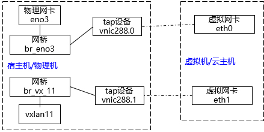
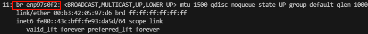

## 相关术语

* 广播域：网络中能接收到同一广播消息的所有设备的集合，任何一个设备发送的广播帧都会被该域的其他设备接收（三层交换机，路由器）
* 冲突域：网络中共享同一带宽，可能会发生数据冲突的区域，同一时间只能有一个设备发送数据（交换机，网桥）
* 二层网络：二层广播域（交换机），仅通过ARP广播获取MAC地址实现通讯
* 三层网络：云主机使用的网络配置，包括ip范围，网关，dns，子网掩码等，数据传送通过ip转发
* 共有网络：一般为可直接访问互联网的网络
* 私有网络：云主机之间连接和使用的内部网络
* 扁平网络：与物理机网络直通，也可以直接访问互联网
* VPC网络：云主机使用的私有网络，可通过VPC路由器访问互联网
* 弹性IP：基于NAT，将一个网络地址转换为另一个网络地址（地址映射）
* 虚拟IP：数据包会被发送到虚拟IP，再路由至云主机
* Underlay网络：相对于Overlay网络，物理网络成为Underlay网络
* Overlay网络：相对于Underlay网络，运行在物理网络之上的虚拟逻辑网络称为Overlay网络

## TCP/IP五层网络模型

| 层数 | 结构    | 主要设备及协议             |
|----|-------|---------------------|
| 5  | 应用层   | HTTP，FTP，SMTP，DHCP等 |
| 4  | 传输层   | TCP，UDP             |
| 3  | 网络层   | IP，ARP（三层交换机，路由器）   |
| 2  | 数据链路层 | 网桥，交换机              |
| 1  | 物理层   | 集线器（HUB），中继器        |

## Linux虚拟网络设备

* Tun设备是一个三层设备，读取和写入IP数据包
* Tap设备是一个二层设备，读取和写入MAC数据帧，与真实的物理网卡能力接近

虚拟机上的eth[x],为虚拟网卡，对应宿主机上的vnic[x]（Tap设备）,它们为一对设备，共同完成虚拟机与外部的通信

* Bridge网桥：同物理交换机差不多，维护一个转发数据库根据MAC地址转发报文。物理设备和虚拟设备都可以桥接到bridge上，接收数据时，由bridge决定数据的走向，但是发送数据时不会被转发到bridge上，会寻找下一个发送出口

## Veth pair

* veth是虚拟以太网卡的缩写（Virtual Ethernet）。veth设备总是成对的，所以被称为veth pair。
* veth pair一端发送的数据会在另一端接收
* veth pair常用于将两端放在不同的network namespace里进行跨network namespace之间的通信

## Network Namespace(网络命名空间)

* Linux内核提供的一种网络隔离机制，用于将不同的网络设备、IP地址、路由表、防火墙规则等网络资源隔离到独立的命名空间中
* 同一个网络设备只能位于一个命名空间中，不同的网络命名空间中的设备可以通过veth pair进行桥接

## VLAN

* 虚拟局域网，是将一个物理的局域网在逻辑上划分成多个广播域
* 可以实现相同的vlan在同一广播域，不同vlan内的报文在数据传输时是相互隔离的
* 用vlan可以划分不同的用户使用不同的网段，便于流量管理
* vlan的数量一共2^12=**4096**个vlanID（0~4095）其中0和4095为系统保留，所以vlanID范围为1~4094

## VXLAN

* 虚拟可扩展的局域网，通过三层网络搭建的虚拟的二层网络
* vxlan可突破vlan4096个子网的数量限制，能够支持2^24个子网
* VNI是每个VXLAN的标识，24位整数，最大值为2^24-2=16777214
* tunnel，隧道，是一个逻辑上的概念，一种虚拟通道，VXLAN通信双方（虚拟机之间）都认为自己在直接通信，并不知道底层网络

## PVLAN

* 一种网络隔离技术，在传统的VLAN基础上提供更细粒度的隔离，同一个VLAN内部隔离不同的实例
* 一个PVLAN下只有一个隔离VLAN
* PVLAN的优势在于精细的访问控制，节省IP资源，提高安全保护
* 可用于同一个三层网络下的vm之间相互隔离
* 创建二层网络时，可开关PVLAN，用于设置是否在云平台中实现 PVLAN 的隔离 VLAN（Isolated VLAN）功能，通常与物理交换机的 PVLAN 功能配合使用
* 二层网络开启后PVLAN后，将实现二层网络内的隔离效果，使用该二层网络创建的三层网络内的云主机之间默认也无法通信。

## 二层网络

* L2NoVlanNetwork:表示相关的物理机对应的网络设备不设置VLAN，如果交换机端口设置了VLAN，则需要在交换机端配置Access模式
* L2VlanNetwork：表示相关的物理机对应的网络设备需要设置VLAN，需在物理机接入的交换机端进行Trunk设置
* 如果集群已加载二层网络，但物理机不存在此二层设备（二层网络绑定的网卡不存在），则物理机不能添加进入该集群
* 如果集群未加载二层网络，物理机也不存在此二层设备，则物理机不能添加进入该集群
* 如果物理机存在此二层设备，但设备接线于集群内其他物理机接线不一样，则会导致创建出来的云主机ip无法正常工作
* 删除二层网络时，其对应的三层网络将被删除，使用此三层网络的云主机的网卡也将被删除

## 三层网络

* 不推荐多个三层网络使用同一个二层网络，否则可能会出现DHCP服务不可用的情况
* 云主机加载三层网络会自动在物理机上创建一个虚拟网卡（vnic）attach到对应的网桥上面

## 路由资源

* MCloud封装了VPC路由器的镜像，只为云路由提供服务，云路由的镜像不能直接用于创建云主机
* 镜像上传地址：
  x86：http://管理节点IP:8080/mcloud/static/mcloud-repo/x86_64/c78/mcloud-tools/MCloud-vRouter-openEuler-22.03.qcow2
  arm：http://管理节点IP:8080/mcloud/static/mcloud-repo/aarch64/openeuler22/mcloud-tools/MCloud-vRouter-openEuler-22.03-aarch64.qcow2
* 创建路由规格时，管理网可以公有网络和系统网络
* VPC路由器为公有网络/VPC网络提供分布式DHCP、DNS、SNAT、弹性IP、端口转发、负载均衡、安全组等网络服务

* 设置网卡QOS，能通过VPC路由器设置网卡的Qos，限制网卡的上行和下行带宽
* 多公网SNAT（Source Network Address Translation)，VPC路由器加载的默认公有网络默认开启SNAT
  * SNAT：源IP地址转换，将**内部VPC网络**中发向公网的数据通过**NAT转化**，将数据包中源地址转成VPC路由器对应**公网网卡的IP地址**
  * 默认公有网络开启SNAT后，VPC网络中云主机可以直接访问互联网
  * 非默认公有网络开启SNAT后，VPC网络中云主机可通过SNAT访问非默认网络中的云主机

* 源进源出：由VPC路由器基本属性中开关。当VPC路由器配置多条公有网络时，将每个公网所触发的外部请求对应的内部响应原路返回，确保数据进出一致。
* 组播数据传输使用UDP协议，接收的云主机防火墙应启用IGMP协议

## 安全组

* 安全组支持的协议包括`tcp、udp、icmp、all`
* 安全组由作用方向、作用对象、协议、端口、优先级（数字越小，优先级越高）组成。为云主机提供三层网络的安全控制，能对tcp、udp、icmp等数据包进行过滤
* 入方向：数据包从外部进入云主机
* 出方向：数据包从云主机往外部发送
* 网卡绑定安全组后才会受安全规则的限制，一张网卡可以绑定多个安全组
* 网卡加入安全组后，除安全规则规定外，默认允许其他所有出方向流量，拒绝其他所有入方向流量
* VPC防火墙管控南北向流量，作用于整个VPC，部署在VPC路由器上。安全组作用于云主机虚拟网卡，侧重保护VPC内部东西向通信安全，部署在云主机上。

## 虚拟IP、弹性IP

* 云路由器成功创建后，系统使用路由器加载的三层网络会自动创建虚拟ip。数据包会发送到虚拟ip，再路由至主机网络
* 弹性IP基于NAT，可将对公网的访问直接关联到内部私有的云主机IP

## 端口转发

* 基于云路由提供的三层转发服务，可以将指定公网ip+端口转发到云主机对应协议的端口上

