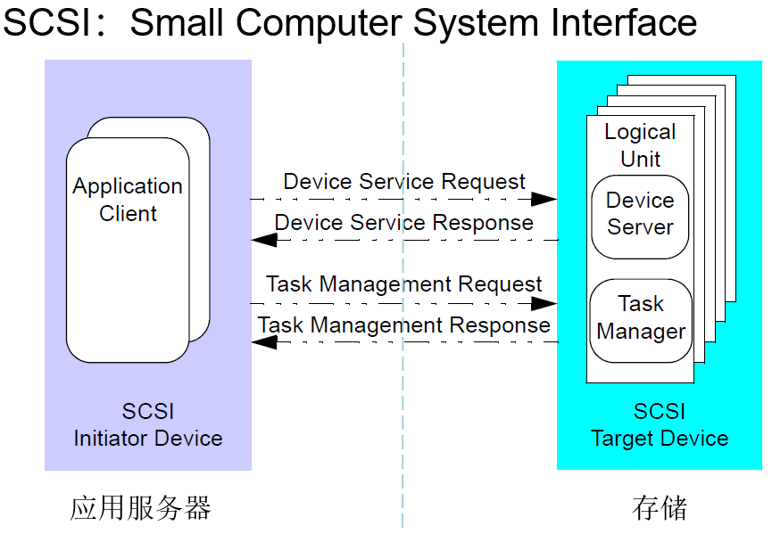

# SAN存储相关知识

* 1.DAS,NAS,SAN:
  * DAS(Direct Attached Storage，直连存储)：存储设备直接连接服务器
  * NAS(Network， Attached Storage，网络附加存储)：通过网络连接，提供文件级的共享存储
  * SAN(Storage Area Network，存储区域网络)：通过专用的高速网络（如FC，iSCSI等协议）提供块存储
* 2.iSCSI协议：SCSI指令（用于块级存储访问）嵌入到TCP/IP数据包中，通过以太网传输指令和数据

## MS存储系列

### 1.MS主机（storage processor unit，spu）


* 分类：
  * 低端：MS10系列，MS25系列
  * 中端：MS30系列，MS50系列
  * 中高端：MS55系列，MS7000
  * 所有产品软件硬件自研，基于ODSP软件架构
* 组成部分：
  * SP：存储处理器，也叫存储控制器，控制数据收发，处理与保护
  * 电源模块
  * 风扇模块
  * 电池模块
  
### 2.MS磁盘扩展柜（Disk shelf unit,dsu）


* 组成部分：
  * EP（Expander Processor）：拓展处理器，也叫磁盘柜控制器
  * 电源模块
  * 风扇模块

### 3.MS存储交换单元（Storage Switch Unit，ssu）


## 常见存储接口

* IDE（Integrated Drive Electronics）：一种硬盘传输接口（以前很老的机械硬盘使用），也叫做ATA（Advanced Technology Attachment）
  
* SCSI（Small Computer System Interface）：一种中线型接口，不是专为硬盘设计的，早期硬盘或者光驱接口，多用在服务器电脑上
  
* SAS（Serial Attached SCSI）：串行连接SCSI，新一代的SCSI技术，可以向下兼容SATA
  
* SATA（Serial ATA）：串行接口，现在电脑常用的硬盘接口
  
* SAS与SATA接口的区别主要在于SAS接口的电源接口与数据接口并没有像SATA那样隔开
  
* NVMe（Non-Volatile Memory Express）：非易失性存储器，使用pcie通道与cpu直连
  

## LUN（Logical Unit Number）

* LUN：用于标识和管理存储设备中的逻辑单元，类似于存储地址。*一个磁盘可以划出多个LUN，多个磁盘也能组成一个LUN*

* LUN属于存储池（Pool），且不能跨Pool，它通常位于以下层级：
  
  ```text
  物理磁盘 
  → RAID组  
    → 存储池  
      → LUN  
        → 文件系统（如NTFS、VMFS、ext4）
  ```

* LUN的基本功能：创建、删除、扩容、修改属性、销毁（需要license）

## SCSI




* Initiator：发起端，发起命令接收响应。对接存储的服务器
* Target：接收端，接收命令，处理指令，返回响应。存储设备上提供存储的网口

I_T_L关联：指Initiator可以通过指定Target访问指定LUN.若干磁盘构成存储池（pool），物理机上创建云主机时，使用的云盘会自动从pool上划分LUN出来，将物理机（i）与存储设备（t）与存储的地方（l）关联起来


在集群环境中，多个服务器可能同时访问同一个LUN，可能会导致数据写坏。需要SCSI Reservation机制来进行SCSI锁的操作。如果有主机向已锁定的磁盘发送读写请求，则会收到`reservation conflict`的报错信息

* FC-SAN：使用光纤通道（Fibre Channel）作为网络介质，使用FC协议，传输SCSI报文
* IP-SAN：使用标准以太网，iSCSI协议传输SCSI报文
