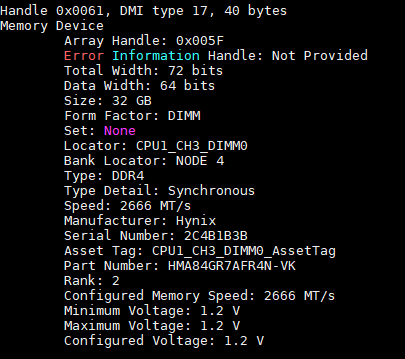

# 新建虚拟机

## 自定义选项

* CPU:
  * CPU、每个插槽内核数，插槽数：ESXi是采用的全虚拟化，没有超线程的概念，也就是说没有物理核心对应逻辑核心，直接虚拟的就是逻辑核心。CPU设置的数量对应线程数，比如我想要4核8线程，直接CPU选8就行了。每个插槽内核数是针对多路CPU的服务器，假设为双路CPU，需要8核，每个插槽内核数如果选择4，此时插槽数就会显示为2，那么就表示这8核会分到两个CPU上。（针对Win的Server系统，最多指支持两路CPU）
  * 硬件虚拟化：是否启用硬件辅助虚拟化，如英特尔的Intel Vt-x和AMD的AMD-V
  * IOMMU（Input-Output Memory Management Unit）:也是一种硬件辅助虚拟化的技术，勾选这个后虚拟机能设备直通，也就是虚拟机直接访问物理设备
  * 性能计数器：用于监控虚拟机的资源使用情况
  * 调度关联性：将虚拟机的虚拟核心绑定到物理核心上，可以避免多台虚拟机只占用同一个核心的情况

* 硬盘：
  * 硬盘置备：控制硬盘空间的分配方式，它有三种方式
    * 精简置备：按需分配，仅在使用时分配空间，需要多少分配多少；好处是节省空间，坏处是降低性能，而且可能会导致碎片化
    * 厚置备置零：先将空间给你分配出来并且立即给你清空，也就是创建时分配空间并初始化，性能最高
    * 厚置备延迟置零：先给你分配空间但不清空数据，只有在需要写入数据时才清空
  * 份额：资源分配的优先级（也就是权重），当多个虚拟机需要同种资源时，它会根据份额决定将资源优先分给谁
  * 限制-I/OPs：限制硬盘的读写速率
  * 控制器位置：控制虚拟磁盘连接的虚拟控制器的类型
  * 磁盘模式：控制硬盘的写入行为，有3中模式
    * 独立-持久：直接写入硬盘，永久保存
    * 独立-非持久：关机或者重启后丢失所有的更改（网吧机子）
    * 丛属：永久保存，并且有快照
  * 共享：字面意思，可以允许多个虚拟机读写该硬盘，但是只能是厚置备指令模式的硬盘

* 引导选项：
  * BIOS：传统引导模式（legacy），最大支持2TB硬盘，支持所有系统
  * UEFI：现代引导模式，可选安全启动，启动速度更快

* 虚拟机参数查询：
  * cpu信息：使用`lscpu`可显示CPU的相关信息，包括指令集，字节序（大端，小端），核数，槽数，虚拟化平台（KVM），虚拟化方式（全虚拟化），缓存大小等，也可以使用`cat /proc/cpuinfo`查看更为详细的信息
  * 内存信息：`free -h`可粗略的查看总内存，可用内存以及交换区的大小，使用`cat /proc/meminfo`查看详细的内存信息，包括基础内存信息，缓存与缓冲区，交换区等等；`dmidecode` 查看物理信息（厂商，大小等）
  
  * 硬盘：`df -h`查看文件系统信息，容量情况以及它们的挂载点；`lsblk`显示系统的块存储（包括磁盘，光驱等）；或者`lshw`在所有硬件数据的disk一项
  以下是一个硬盘容量为20G的ubuntu服务器块存储信息
  
  ```text
    hycer@ubuntu:~$ lsblk
  NAME                      MAJ:MIN RM   SIZE RO TYPE MOUNTPOINTS
  loop0                       7:0    0  49.3M  1 loop /snap/snapd/24792 // snap包创建的只读虚拟设备
  loop1                       7:1    0  73.9M  1 loop /snap/core22/2010
  loop2                       7:2    0 140.6M  1 loop /snap/docker/3265
  sda                         8:0    0    20G  0 disk                   // 分配的20G硬盘
  ├─sda1                      8:1    0   953M  0 part /boot/efi         // 引导分区，存储uefi引导加载程序
  ├─sda2                      8:2    0   1.8G  0 part /boot             // 内核分区，存储系统启动相关的程序
  └─sda3                      8:3    0  17.3G  0 part                   // 剩下17.3G为物理卷用于其他存储分配，被LVM管理 
    └─ubuntu--vg-ubuntu--lv 252:0    0    10G  0 lvm  /                 // 逻辑卷（好比win分出来的CDEF盘），10G用于挂载根目录，另外7.3G未分配，可用LVM管理分配
  sr0                        11:0    1     3G  0 rom                    // sr表示光驱，此处挂载的是系统的安装镜像
  ```

  * 网络：使用`ifconfig`(需要安装net-tools包)或者ip addr查看网络信息，包括网卡名，ipV4/v6，子网掩码，广播地址，MAC，上传数据量，下载数据量等
  * PCIe设备：`lspci`,对于虚拟机来说更多的是虚拟化设备（由Red Hat/QEMU提供），比如虚拟显卡，虚拟网卡，虚拟SCSI控制器等等
  * 系统及内核：`cat /proc/version`, 只看内核可以使用`uname -a`，`lsb_release -a`可以显示Linux发行版信息
  
