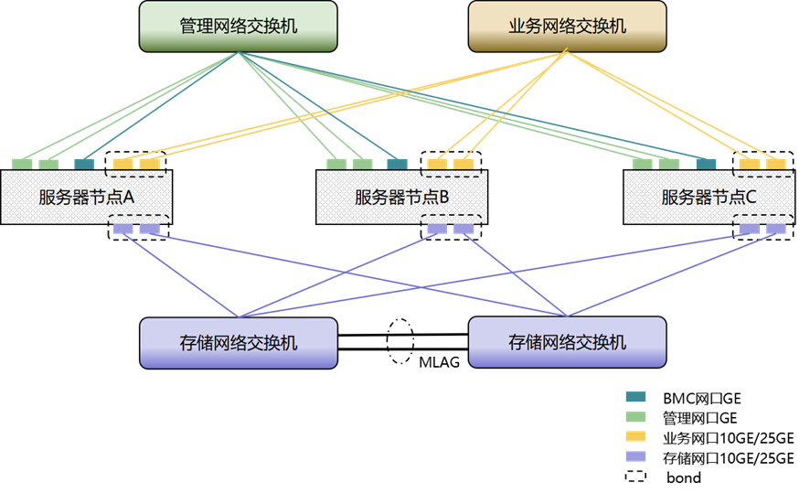
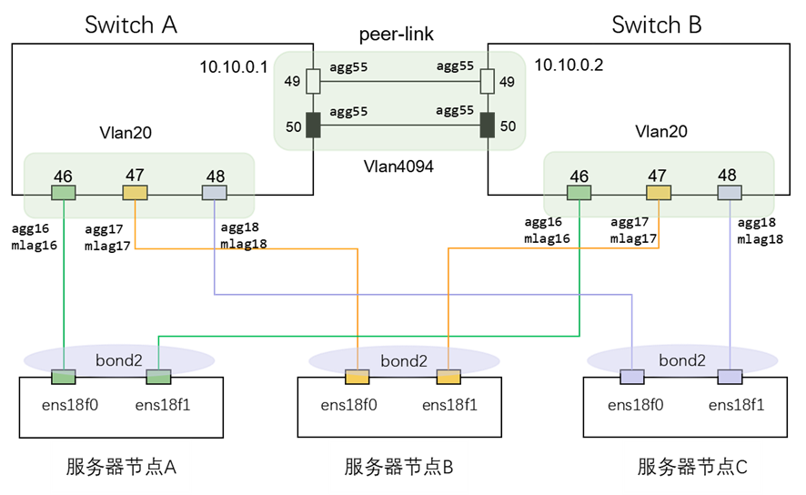

## 硬件组网

* 1.MCloud3012G2服务器配置：
  * CPU：双路
  * 内存：至少128G
  * IO插卡：至少配置2张2x25GE或者2张2x10GE或者1张4x10GE
  * 系统盘：2*480GB SSD 组RAID1
  * 缓存盘：NVMe SSD至少1.92TB
  * 数据盘：

* 2.交换机配置：
  * 管理网络（用于系统管理和维护）：1台千兆交换机且接口数大于2N（N为服务器节点）
  * 存储网络（用于存储节点间数据通信）：2台10GE/25GE交换机
  * 业务网络（用于客户业务通信）：1/2台10GE/25GE交换机
  * BMC网络（用于服务器硬件管理和维护）：1台千兆交换机且接口数大于N

* 3.硬件组网：
  

* 4.网络规划：
  * BMC网络：每台服务器一个IP
  * 管理网络：每个节点2个千兆网口做bond，每个节点一个IP
  * 管理VIP：与管理网络同网段，每套环境一个IP
  * 存储网络：必须与外网隔离，每个节点2个10GE/25GE网口做bond，bond模式为`mode=4，miimon=100，xmit_hash_policy=layer3+4`（动态链路聚合，实现负载均衡和故障切换；设置每100毫秒检测一次链路状态，流量分配策略基于 源/目的IP（Layer 3）和端口（Layer 4）的哈希值，确保同一数据流的流量走同一物理网卡），网口设置为access模式，最大传输字节（MTU）为9000字节。
  * 业务网络：网口为trunk模式，不需要配置IP（用户创建云主机是才会配置网络），不能使用存储和管理网络
  * 迁移网络：每台服务器一个IP，可复用业务网络但不能使用存储和管理网络
  * iSCSI网络（用于MCloud和MDBS数据读写通信）：可复用存储网络，不可使用业务网络
  * 补充bond模式：
    * mode0：balance-rr，通过轮询的方式将数据包发送到各个接口（不是每个接口都发一遍，通过轮询将数据包分配给各个接口），能实现负载均衡
    * mode1：active-backup，只有一个接口活跃，其余的接口用作备用，仅在活动接口故障时接管，提供了故障切换和冗余性
    * mode2：balance-xor，根据数据包的源MAC和目的MAC地址以及传输层协议和端口号的哈希值来固定选择某个接口，也是通过轮询的方式，但不像mode1那样简单的轮询，它会轮询并匹配哈希值，这就使得同一个连接的数据包始终走同一个接口，避免TCP乱序的问题，能提供负载均衡
    * mode3：broadcast，将所有数据包发送给所有接口，广播传输
    * mode4：802.3ad，也称为“LACP”（Link Aggregation Control Protocol）模式。交换机和服务器之间能通过LACP协议动态协商，根据接口的流量分配接口，一个故障会切换到另一条，实现负载均衡
    * mode5：balance-tlb，发送数据包（上传）根据算法（TLB）分配给不同的接口，但接收数据包（下载）只使用一个接口，在接收方向实现负载均衡，适用于上传流量大的情况（直播推流，视频监控）
    * mode6：balance-alb，发送和接收都会根据算法分配给不同的接口，比mode5更均衡
  * 补充网口模式：
    * access模式：只能传输一个VLAN，用于连接终端设备（电脑，打印机）
    * trunk模式：可以传输多个VLAN，允许通过的VLAN才能进入，用于连接其他交换机或路由器
    * Hybrid模式：可以传输多个VLAN，不对承载的数据打标签

* 5.交换机配置
  
  将两台交换机hostname修改成不同的主机名，如SwitchA、SwitchB

  ```sh
  Switch# configure terminal
  Enter configuration commands, one per line.  End with CNTL/Z.
  Switch(config)# hostname SwitchA                                                         #修改主机名为SwitchA
  SwitchA(config)# do wr
  Building configuration...
  [OK]
  SwitchA(config)#
  ```

  配置管理IP

  ```sh
  SwitchA# configure terminal
  SwitchA(config)# management ip address 172.22.99.98/16
  SwitchA(config)# management route add gateway 172.22.0.1
  #设置交换机管理IP、子网掩码、网关，实际以配置为准
  SwitchA(config)# do wr
  Building configuration...
  [OK]
  SwitchA(config)# exit
  SwitchA# show management ip address
  ```
  
  设置端口速率，配置MLAG（两个交换机逻辑上合二为一）

* 6.服务器配置：
  使用`cat /etc/version`查询系统版本
  使用`lsblk`查看系统盘分区大小，确保boot分区有1024M，boot/efi分区有500M，core分区100G，/var/log分区20G
  使用`swapon -s`检查确保没有swap分区

* 资源预留：
  集群可用CPU资源=（CPU总颗数*单颗CPU超线程数-(M+ 12*n)*1）*超分率 *0.8
  M为集群所有数据盘数，n为计算存储节点数
  
  单节点可用内存 = 总内存 - 26GB  - 缓存盘占用内存 – 数据盘占用内存
  26GB为操作系统8GB+10GMDBS基础服务+8GMCloud云平台管理，缓存盘每个缓存分区占用2GB，数据盘占用=数据盘数*N（数据盘容量<=8TB,N=4G，否则N=5G）

  分布式块冗余可用容量 = 单节点裸容量 * 节点数 * 冗余利用率 * 0.8
  仅支持3副本，冗余利用率为33.33%