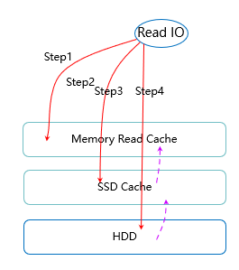
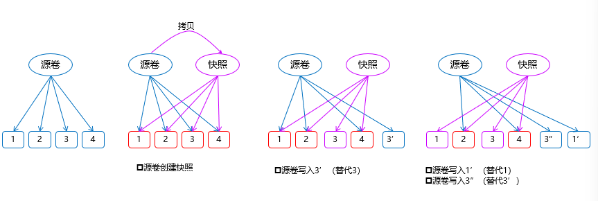

* MDBS（MacroSAN Distributed Block Storage）：宏杉分布式块存储，通过组织服务器的本地硬盘，提供高性能和高可靠性的存储业务

* 存储池：存储池是一种逻辑结构，将多个磁盘组成一个存储池，然后进行逻辑划分，主要用于数据隔离。存储池安全级别支持硬盘级（默认支持）、节点级、机柜级

* 卷：卷是存储池的逻辑划分，通常一个卷对应一个逻辑磁盘，卷大小必须小于等于存储池大小

* RCache（读缓存）：每个节点固定划分512MB内存作为卷的读缓存，单个Cache块大小为64KB。支持对单个卷启用禁用RCache。RCache能有效提升性能

* SSD读写缓存：选用SSD（NVMe/SAS/SATA）作为缓存盘，每块SSD盘均匀划分出N个区，每个分区对应一个HDD的数据盘，用作数据盘的读写缓存。目前2U服务器暂定N=6，即1块SSD对应6块HDD，SSD划分6个分区

* OSD：每个OSD对应一个HDD硬盘，运行在服务器上，是一个管理HDD的服务进程，负责存储数据、读写数据

* 读IO流程(_仅可能从本地副本读取数据_)：

  * 1. 从内存读Cache中获取数据，若命中，则直接返回数据，否则继续下一步
  * 2. 从SSD Cache中获取数据，若命中，则返回数据，并且如果该IO数据达到一定的读取次数将被缓存到RCache中；否则继续下一步
  * 3. 从HDD硬盘中获取数据，返回数据，如果该IO数据达到一定的读取次数将被缓存到SSD Cache中

* 写IO流程(_所有写IO均需经过内存读缓存，若有写命中读，则将对应读数据置为无效（旧数据已过时）_)：
  * 小IO：将小IO缓存在SSD Cache后，完成本节点的写操作。**当SSD写缓存中的数据达到一定量或者一定周期后，批量将数据写入HDD**
  * 大IO：直接透写入HDD

* 多副本：MDBS利用多副本机制保证数据可靠性，同一份数据可以复制保存为2~3个副本；创建存储池时，可选择副本数量（2或3），以及数据可读写策略（1/3，2/3）：指在决策过程中，需要多少个副本达成一致才能进行下一步。
如2/3，一次写操作必须至少成功写入2个副本，这次写操作才会被系统认为是成功的。一次读操作必须至少从2个副本读取到数据，并比对一致后，才能将结果返回给用户
* 精简配置：可创建容量大于存储池物理容量的逻辑卷，以满足特殊的容量规划需求，再按**需分配空间**，提升空间的利用率

* 快照：将用户的卷数据在某个时间点的状态保存下来，后续可恢复数据。MDBS快照数据在存储时采用ROW（Redirect on write）写时重定向机制，不会造成源卷性能下降

  * 创建快照时会将源卷拷贝一份，快照卷指向源卷相同的存储空间
  * 当源卷发生写入时，源卷会将原来的存储空间拷贝出一份用于写入并替代原存储空间（COW，copy on write 写时拷贝）