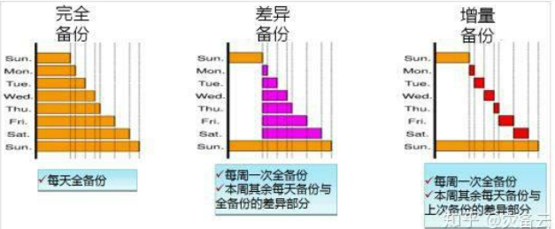
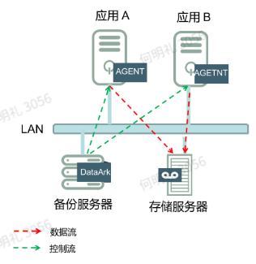

# 备份基础

## 备份基础概念

* 备份窗口：执行备份的时间段
* RTO（recovery time objective）：用于衡量系统恢复的速度，业务恢复的最长可接受时间
* RPO（recovery point objective）：用于衡量数据丢失的容忍度，允许丢失的数据量
* 数据保留周期：备份数据保留的时间
* 事件触发：触发备份的事件
* 3+2+1备份原则：3份数据，1份原数据，2份备份数据；2种备份介质，硬盘+云存储；1份离线存储

## 备份种类

* 普通文件、系统备份
* 数据库备份
* 虚拟平台高效保护
* 操作系统保护

## 备份类型

* 完全备份：每次备份都完全复制数据
* 增量备份：只备份**上次备份**后新增的或修改的数据
* 差异备份：备份自**上次完全备份后**所有变化的数据

* 物理备份：直接复制数据块
* 逻辑备份：导出数据操作步骤（如数据库导出表和sql语句）
* 合成备份：将完全备份和后续的增量或差异备份合并得到一个新的完全备份

## 备份方式

* LAN：部署一台备份服务器，应用服务器通过网络将存储服务器的数据上传到备份服务器(会占用应用服务器的带宽)
  
* LAN-Free
* Server-Free
* NDMP

## 存储

* 存储连接的几种方式
  * 直接存储DAS：通过物理线缆直接连接存储，块级存储（涉及SCSI协议，IP协议，FC协议）
  * 网络附加存储NAS：存储设备通过网络实现文件夹共享，文件级存储（涉及TCP/IP协议）
  * IP-SAN存储：以太网版的的SAN（涉及iSCSI协议），块级存储
  * 存储区域网络SAN：通过专用高速网络（光纤等）连接存储阵列，块级存储（涉及FC-SAN协议）
  
## 容灾

* 容灾：利用特定的技术和方法，提前建立系统化的数据应急方式，以应对灾难的发生

* 容灾分裂：
  * 从距离分类：1.同城异地容灾，建立两个数据中心（相距<=200KM）,一个用作日常使用，另一个做备份中心；2.异地容灾，两个数据中心相距较远（>200KM）,一般采用异步方式实现，会有少量数据丢失
  * 从业务上分类：1.数据级容灾，只做数据的远程备份，确保数据不会丢失或者被破坏；2.应用级容灾，建立一套完整的与本地生产系统相当的备用系统，在本地业务出现灾难时能够接管本地业务，并且能在本地业务正常后完全恢复数据

* 备份容灾常用技术：
  * 定时备份
  * 数据复制
  * CDP（Continuous Data Protection）持续数据保护
  * CDM（Copy Data Management）副本数据管理
