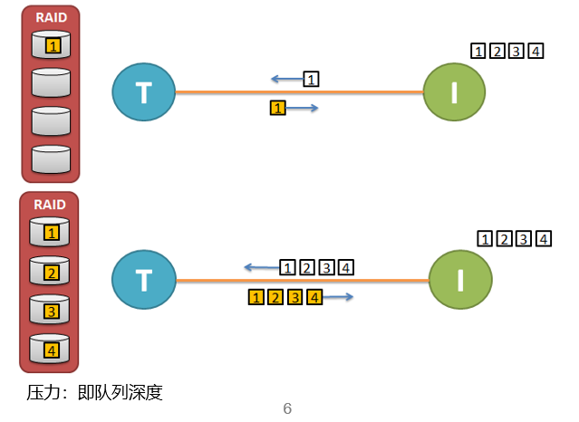

### I/O命令

* I/O命令基本属性包括：读写类型（Read/Write),命令块大小(cmdBlockSize)
* I/O命令性能指标：命令延时(cmdRespTime)
* `读`操作为前台操作，`写`操作为后台操作

### I/O模型
三个基本属性：
* 平均块大小（AvgBlockSize）：I/O请求序列中所有请求的块大小的平均值，一般单位是B、KB、MB。通常简称为块大小（BlockSize）
* 读写比例（ReadPct/WritePct）：读和写请求再I/O请求序列中的比例，可以用IOPS或MBPS来衡量
* 随机度分布（SeqPct/RandPct)：顺序和随机请求在I/O请求序列中所占的比例，随机一般指均匀分布

### I/O队列


### I/O模型性能指标
特定I/O模型以及特定压力大小下I/O处理能力

* 吞吐量（MBPS）：每秒传输的数据量
* 每秒请求数（IOPS）：每秒处理的I/O请求数
* 平均延时（AvgRespTime）：I/O请求处理平均耗时，单位多用ms表示

关联关系：

$$$
MBPS = IOPS * BlockSize
$$$

$$$
IOPS = QueDepth / RespTime
$$$

$$$
MBPS = QueDepth * BlockSize / RespTime
$$$

* 性能影响的因素：CPU，内存，磁盘性能，网络性能，系统多层队列处理机制

### vdbench

vdbench是一款用于基准测试存储产品的磁盘io负载生成器。

#### 使用说明

vdbench的使用需要操作系统安装java运行环境，同时采用命令行的方式进行测试。

* 通常，可以使用下方命令进行测试：

```shell
./vdbench -f <vdbench_file> -o <output_file>

# -f 指定测试负载参数文件，-o 指定测试结果输出目录，默认为当前目录
```

##### 负载参数文件

vdbench按照**一定的顺序**来解析文件，对于磁盘测试：General，HD，SD，WD和RD；对于文件系统测试：General，HS，FSD，FWD和RD
例如：

```text
# General（通用定义）
dedupratio=30
journal=yes
report=host_detail
# HD（主机定义）
hd=hd1,system=localhost,vdbench=/home/vdbench,user=root,jvms=8
# FSD（文件系统存储定义）
fsd=fsd1,anchor=Y:\nasPerf,depth=2,width=3,files=1000,size=(64k,40,128k,30,512k,30)
# FWD（文件系统工作负载定义）
fwd=fwd1,fsd=fsd*,operation=read,xfersize=8k,fileio=random,fileselect=random,threads=32
# RD（运行定义）
rd=rd1,fwd=fwd1,fwdrate=max,format=yes,elapsed=300,interval=1
```

##### 裸盘测试参数

* 1.General 通用定义
```text
# General parameters

compratio=nn # 定义写入磁盘的数据压缩比
dedupratio= nn # 重删比，默认为1 （全部数据块都是不同的）
dedupunit= nn # 重删数据块的大小，默认128KB
dedupsets= # 多少个重删数据，默认5%。比如1024个128K的SD，5%就是51个重删数据，也就是把重删的那一部分数据分成51组，每一组中的数据都是一样的。 
concatenatesds=yes #联合测试，把所有SD定义的存储当作一个LUN测试。
create_anchors=yes #在FSD定义中，生成根目录

ios_per_jvm=nnnnnn # 每一个java虚拟机每秒可运行的最大IO操作，默认为100,000
loop=nn # 重复运行测试多少次repeat nn times
loop=nn[s|m|h] # 在多少时间后，重复测试
pattern= # 重新定义生成的数据模型
port=nn # 重新指定Java端口
showlba=yes # 收集数据，用于showlba分析
messagescan=no # 不浏览、打印系统日志
```

* 2.HD 主机定义
```text
# HD（主机定义）
hd=default,vdbench=/home/vdbench,shell=ssh,user=root # 该行定义的参数为下面所有主机的全局参数，如果某个主机有单独的参数则会覆盖该行参数
hd=hd1,system=localhost,vdbench=/root/vdbench
hd=hd2,system=172.0.73.23
hd=hd3,system=172.0.73.24

# 常用参数说明
# hd=default 设置全局参数
# hd=localhost 设置当前主机参数
# hd=hd1 添加主机参数
# system=xxx 指定主机ip
# vdbench=xxx 添加主机的vdbench路径
# jvms=nn 指定java虚拟机数量
# shell=xxx 指定通信协议，以控制远程主机开启vdbench
# user=xxx 指定远程主机登录用户名
```

* 3.SD 存储定义，设置需要测试的磁盘、lvm卷和文件相关参数
```text
# SD
sd=sd1,host=hd1,lun=/dev/mapper/mpathb,openflags=o_direct,thread=8 
# 定义了一个名为sd1的测试目标。它使用8个并发线程，通过Direct I/O的方式，对连接在 hd1 主机上、由多路径软件管理的名为 /dev/mapper/mpathb的LUN，进行性能压测。
sd=sd2,host=hd2,lun=/dev/mapper/mpathc,openflags=o_direct,thread=8

# 常用参数说明
# sd=default # 设置全局参数
# sd=name # 设置该sd的别名
# dedupratio= # 参考General中的定义，除了dedupunit必须在General中定义外，其余的重删参数都可以给特定的SD定义。
# dedupsets=
# deduphotsets=
# dedupflipflop=
# hitarea=nn # 读命中大小，默认1m。配合rhpct、whpct使用
# host=name # 指定该SD在哪台主机，如果不设置 默认在当前主机
# journal=xxx # 指定检验日志目录
# lun=lun_name # 指定磁盘或文件
# openflags=(flag,..) # 通过特定的方式打开LUN或文件，绕过缓存常用的参数；常见参数：linux：o_direct or directio,o_dsync,o_rsync,o_sync,fsync;windows:directio,o_dsync,o_rsync,o_sync
# range=(nn,mm) # 指定测试的范围，默认是全盘
# size=nn # 用于工作负载的文件/磁盘大小（非必需）
# threads=nn # 该SD的最大并发数（outstanding I/O），默认为8
```

* 4.WD 工作负载定义

```text
wd=wd1,sd=(sd1,sd2),rdpct=100,xfersize=4k

# 常用参数说明
# wd=default # 设置工作负载全局参数
# wd=name # 设置该工作负载的别名
# sd=xx # 指定该工作负载用于那个存储定义（sd）
# host=host_label # 指定哪个主机运行该工作负载，默认为本地主机
# iorate=nn # 设置该工作负载的固定IOPS
# openflags=(flag,..) # 通过特定的方式打开lun或文件
# priority=nn # 该工作负载的优先级，=1 最高，往后递降
# range=(nn,nn) # 限定该工作负载在SD上的作用范围
# rdpct=nn # 读占比，默认100
# rhpct=nn # 读命中占比，默认0
# seekpct=nn # 随机IO占比，默认seekpct=100或seekpct=random
# skew=nn # 该工作负载占总IO的比例，也就是可以规定不同的工作负载比例
# streams=(nn,mm) # 在同一个设备（lun/文件）上建立多个顺序IO流
# stride=(min,max) # To allow for skip-sequential I/O.
# threads=nn # IO并发数，只有在联合SD的情况下能使用（见SD concatenation)
# whpct=nn # 写命中占比，默认为0
# xfersize=nn # IO块大小，默认4K
# xfersize=(n,m,n,m,..) # 指定IO块大小的分布
# xfersize=(min,max,align) # 在(min,max)的范围内随机生成IO块大小
```

* 5.RD 运行定义

```text
rd=run1,wd=(wd1,wd2),iorate=1000,elapsed=60,interval=5
# 定义了一个名为run1的测试任务：同时启动wd1和wd2两种工作负载，整体的I/O速率限制在1000IOPS。持续运行60秒，且每隔5秒就会在屏幕上打印一次性能统计信息。

# 常用参数说明
# rd=default # 设置rd全局参数
# rd=name # rd别名
# wd=xx # 该RD作用于哪个工作负载
# sd=xxx # 该RD作用于哪些SDs（可选）
# interval=nn # 打印间隔
# elapsed=nn # 运行时间，默认30秒
# maxdata=nn. # 本次测试的最大文件大小。当elapsed或者maxdata达到设定值，IO都会停止
# openflags=xxxx # 通过特定的方式打开文件或LUN
# warmup=nn # 预热时间
```

##### 文件系统测试参数

* 1.FSD 文件系统定义

```text
fsd=fsd1,anchor=/dir1,depth=2,width=2,files=2,size=128k

# 常用参数说明
# fsd=name # 设置FSD别名
# fsd=default # FSD全局参数
# anchor=/dir/ # 测试目录
# depth=nn # 目录深度
# distribution=all # 每个目录都生成文件，默认只在最底层目录生成文件
# width=nn # 设置每层级多少个目录
# files=nn # 每个最底层目录生成多少个文件
# openflags=(flag,..) # 通过特定方式处理IO请求
# shared=yes/no # 是否共享FSD给不同的Slaves或主机。文件数量很大的时候，为了减少slaves间关于文件状态信息的交流，可以使用 shared ，让每个slaves使用属于自己的那一部分文件。
# sizes=(nn,nn,…..) # 文件大小
# totalsize=nnn # 总文件大小
# journal=dir # 数据检验日志目录
```

* 2.FWD 文件系统工作负载定义

```text
fwd=fwd1,fsd=fsd1,operation=read,xfersize=4k,fileio=sequential,fileselect=random,threads=2

# 常用参数说明
# fwd=name # FWD别名
# fwd=default # FWD全局参数
# fsd=(xx,….) # 该工作负载作用于哪些FSD（文件系统定义）
# fileio=(random.shared) # 允许多个线程共用一个文件
# fileio=(seq,delete) # 顺序IO，当第一次写入时，先删除文件
# fileio=random # 随机文件IO
# fileio=sequential # 顺序文件IO
# fileselect=random/seq # 如何选择一个目录或文件
# host=host_label # 该工作负载作用于哪个主机
# operation=xxxx # 规定对文件的操作
# # mkdir, rmdir, create, delete, open, close, read, write, access, getattr and setattr    
# rdpct=nn # 混合读写中的读占比（只能用于  operation=read 和 operation=write）
# skew=nn # 该工作负载占比
# threads=nn # 线程数 （文件数需要大于线程数）
# xfersize=(nn,…) # 读写文件时的IO块大小
```

* 3.RD （文件系统独有的参数）

```text
rd=rd1,fwd=fwd1,fwdrate=max,format=yes,elapsed=10,interval=1

# 常用参数说明
# fwd=(xx,yy,..) # 该运行定义作用于哪个工作负载
# fwdrate=nn # 每秒的操作数
# format=yes/no/only/restart/clean/once/directories # 是否重新创建（格式化）XXX
# operations=xx # 覆盖FWD中的文件操作
```

##### 测试示例

测试参数：

云主机3块盘，每块盘8线程，读占比70%，io速率尽可能最大，测试2小时，每5s打印结果

```text
# 3lun_4k
hd=default,vdbench=/root/vdbench50406,user=root,shell=ssh
hd=host1,system=localhost

sd=sd1,lun=/dev/vdb,openflags=directio,threads=8
sd=sd2,lun=/dev/vdc,openflags=directio,threads=8
sd=sd3,lun=/dev/vdd,openflags=directio,threads=8

wd=wd1,sd=sd*,rdpct=70,xfersize=4k
rd=run1,wd=wd1,iorate=max,elapsed=2h,interval=5
```

测试命令：
```shell
nohup ./vdbench -f 3lun_4k -vr &
```
观察测试结果：
```shell
tail -f nohup.out
```
查看测试报告：summary.html
