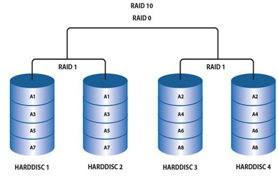

# 服务器硬件基本概念

## 服务器概念

* 服务器分类：
  * 按指令集分：**CISC复杂指令集**服务器（X86架构）、**RISC精简指令集**服务器（非X86架构）
  * 按外形分：塔式（形似家用主机）、机架式、刀片式、高密
  
  * 按处理器数量分：单路服务器（1颗CPU）、双路服务器（2颗CPU）、多路服务器（4颗及以上CPU）

* BIOS的功能：**计算机启动时加载的第一个软件**，主要用于POST自检，检测输入输出设备和可启动设备，包括内存初始化、硬件扫描和寻找启动设备、启动系统，高级电源管理，配置RAID，查看系统信息。在Linux系统中，可以使用指令`sudo dmidecode -t bios`查看bios的相关信息
  
* UEFI和Legacy模式：
  * **主流服务器BIOS默认为UEFI模式**，相较于传统的Legacy，可以支持从大于2.2T的GPT格式硬盘引导，支持网络PXE引导，提供UEFI Shell环境
  * 没有特殊需求一般为UEFI模式，**备份则为Legacy模式**

* BMC（基板管理控制器）：用于监控和管理服务器的专用控制器，它是一个**独立的系统**，只要上电BMC软件就能快速运转起来，主要功能包括：
  * **设备信息管理**：记录服务器型号，制造商，日期，主板信息等，BMC可以通过Web界面方式查看系统信息
  * **服务器状态监控管理**：对服务器的CPU、内存、硬盘、风扇、机框等部件的温度、电压等健康状态进行管理
  * **服务器远程控制**：服务器开关机、重启、维护、固件更新、系统安装等
  * **维护管理**：日志管理，用户管理，BIOS管理，告警管理等
  

* IPMI：是一组交互标准管理规范，其实就是BMC系统，可独立运行的板上部件，主要用于服务器系统集群自治，监视服务器的物理健康状态，同时还负责记录各种硬件的信息和日志记录
  
* redfish：是IPMI规范的新一代标准，它基于**HTTPS**服务的管理标准，利用restful接口实现设备管理。与IPMI相比更简单，更安全（基于HTTPS）
  
* CPU缓存：为CPU和内存之间的临时存储器，目前的CPU拥有三级缓存。缓存具有极快的存取速度，它是硬盘与外部接口之间的缓冲器。

* CPU的频率：**主频 = 外频 * 倍频** **主频为CPU的额定工作频率**，主频越高，CPU性能越好
  * 外频（Base Clock）为CPU的**基准时钟频率**，单位为`MHz`
  * 倍频是指CPU主频与外频之间的**相对比例**关系，是CPU内部的一个放大系数
  * 在Linux中可以使用`lscpu`指令查看cpu的相关参数或查看`/proc/cpuinfo`文件
  
* 超线程：一颗CPU同时执行多个程序且共同分享一颗CPU内的资源。当两个线程都同时需要某一资源时，其中一个要暂时停止，并让出资源，知道资源闲置后才能继续，因此超线程的性能并等于两颗CPU的性能

* CPU相关概念：
  * 物理CPU：即主板上插了几块CPU，查看指令：
  
  ```sh
  cat /proc/cpuinfo | grep "physical id" // 查看所有的id，有多少个id就有多少个CPU
  ```

  * CPU物理核心（core）：一颗物理CPU中包含的核心数量（**6核**12线程），查看指令：

  ```sh
  cat /proc/cpuinfo | grep "cpu cores" // 直接查看cpu cores的值，也就是核心数量
  cat /proc/cpuinfo | grep "core id" // 查看核心id，有多少个id就有多少个核心
  ```

  * CPU逻辑核数（线程数）：通过超线程技术，将一个物理核心分成多个逻辑核心（6核**12线程**），查看指令：
  
  ```sh
  cat /proc/cpuinfo | grep "processor" | sort -u | wc -l // sort为对文本进行排序 -u 参数为对结果去重（unique），wc（words count）为文本统计 -l 参数则是统计行数（line）
  ```

  * CPU中断：系统发生了非寻常的急需处理事件，CPU短暂中断当前执行的程序转而去执行相应的事件处理程序，处理完毕后返回原来被中断处继续执行。
  
* 内存条物理结构：
  * DDR1 = 大片（颗粒）+ 圆口（金手指缺口）
  * DDR2 = 小片 + 圆口
  * DDR3 = 小片 + 方口
  * DDR4 = 小片 + 方口（金手指中间稍突出，边缘收矮，方便插入）
  

* 内存保护技术：
  * ECC（Error Checking and Correcting）：能发现数据位上的错误并纠正错误（所以比普通内存贵，但也因为需要计算校验码，延迟稍高，性能比普通内存略低）
  * ChipKill：一种IBM研发的高阶内存容错技术，可以理解为“ECC内存的超级加强版”。能修复整个内存芯片（Chip）损坏导致的错误。

* 内存条规格识别：
  
  RANK: 内存列，CPU与内存的接口位宽一般为64bit，单个内存颗粒仅有4、8bit，因此必须把多个颗粒并联起来，组成一个宽为64bit的数据集合，64bit集合称为一个RANK.`2Rx4`则代表该内存有两个RANK，每个RANK由4个颗粒并联组成

* 内存配置原则：
  * 所有内存通道配置一样的内存（包括速率，容量，RANK等）
  * 多颗CPU时，首先保持各个CPU的内存配置一样
  * 只有一条内存时，必须插在给定通道的slot0槽位（离CPU最远的位置）

* 内存带宽计算：
  
$$
满配最大内存带宽 = 内存标称频率 * 内存总线位数 * 通道数 * CPU个数
$$

$$
实际使用的内存带宽 = 内存标称频率 * 内存总线位数 * 实际使用的通道数
$$
  
* 硬盘类型：
  * 介质： 机械硬盘（HDD）、固态硬盘（SSD）
  * 盘径： 5.25、3.5、2.5、1.8（英寸）
  * 接口： ATA/IDE、SATA/NL SAS、SCSI、SAS、FC
  * 功能： 桌面级、企业级
  * 业务类型：
    * HDD：企业级Performance类、企业级Capacity类、企业级云盘类、桌面级硬盘类
    * SSD：读密集型、均衡型、写密集型

* 硬盘颗粒（NAND Flash）类型：

|类型|全称|每单元比特数|寿命（每写入擦除循环）|速度|价格|
|-----|-----|-----|-----|-----|-----|
|SLC|Signle-Level Cell|1bit|5w~10w|⭐⭐⭐⭐⭐|⭐⭐⭐⭐⭐|
|MLC|Multi-Level Cell|2bit|3k~1w|⭐⭐⭐⭐|⭐⭐⭐⭐|
|TLC|Triple-Level Cell|3bit|500~3000|⭐⭐⭐|⭐⭐|
|QLC|Quad-Level Cell|4bit|100~1000|⭐⭐|⭐|

* 系统盘：安装操作系统的硬盘为系统盘，服务器环境下要求做RAID1.在linux系统可通过`lsblk`命令识别系统盘（挂载点为`/boot`的硬盘）

* RAID（Redundant Array of Independent Disks）：独立硬盘冗余阵列，简称硬盘阵列。对硬盘的使用策略，基本思想就是把多个相对便宜的硬盘组合起来，成为一个硬盘阵列组，对计算机来说就像一个单独的硬盘或逻辑存储单元。

* 常见的RAID类型：RAID-0，RAID-1，RAID-5，RAID-6，RAID-10：
  * RAID-0：写数据时将数据分为N份，以独立的方式实现N块磁盘的读写，将N份数据并发写入磁盘中，性能非常高，没有容错
  * RAID-1：将同一份数据无差别的写两份到磁盘（将磁盘分为两份，一份工作，一份镜像），有镜像冗余
  * RAID-10：首先基于RAID-1模式将磁盘分为两份，随后将这两份RAID-1以RAID-0模式组合起来，既保证了效率又保证了安全，有镜像冗余
  
  * RAID-5：至少需要3块硬盘，数据分布存储（类似RAID-0）+ 奇偶校验信息（用于恢复数据）轮流存储在不同的硬盘上，因此单硬盘故障不影响数据
  * RAID-6：至少需要4块硬盘，双硬盘容错
  
* JBOD（Just Bundle of Disks）：简单磁盘捆绑，将两块硬盘捆绑为一个大硬盘
  
* RAID卡： 磁盘阵列卡，用于统一管理服务器的磁盘，支持RAID和JBOD两种模式
* SAS卡： 不只用来连接SAS硬盘，**还是一种低端RAID卡，一般只能做RAID-0，RAID-1**

* HBA（Host Bus Adapter）卡：主机总线适配器，在服务器与存储设备之间提供IO，可以将主机的PCIe协议转化为存储设备支持的协议（如SAS、FC等）

* Riser卡：就是用于扩展PCIe插槽的卡

* PCIe通道标准：

|  |X1|X2|X4|X8|X16|
|-----|-----|-----|-----|-----|----|
|**PCIe1.0**|250MB/s|500MB/s|1GB/s|2GB/s|4GB/s|
|**PCIe2.0**|500MB/s|1GB/s|2GB/s|4GB/s|8GB/s|
|**PCIe3.0**|1GB/s|2GB/s|4GB/s|8GB/s|16GB/s|
|**PCIe4.0**|2GB/s|4GB/s|8GB/s|16GB/s|32GB/s|
