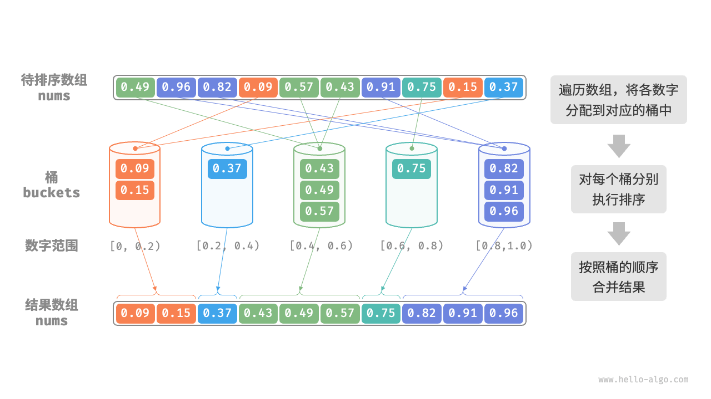
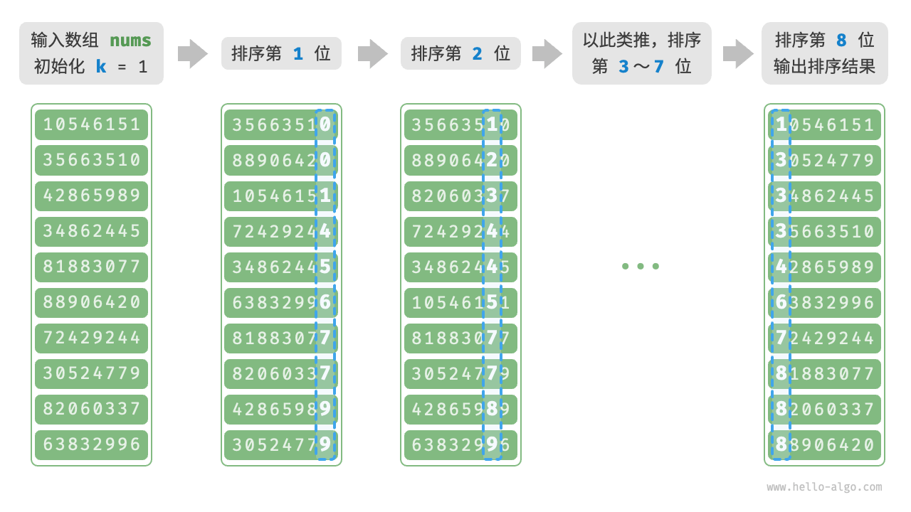

# 算法-排序

## 选择排序

选择排序（selection sort）的工作原理非常简单：开启一个循环，每轮从未排序区间选择最小的元素，将其放到已排序区间的末尾。

```go
// SelectionSort
//
//	@Description: 选择排序由小到大
//	@param nums 待排序数组
//	@return []int 排序后的数组
func SelectionSort(nums []int) []int {
	n := len(nums)
	// 外层循环,控制未排序区间
	// 只循环到n-2,因为最后一个元素不需要再比较
	for i := 0; i < n-1; i++ {
		minIndex := i
		// 内层循环,找到未排序区间的最小值的索引
		for j := i; j < n; j++ {
			if nums[j] < nums[minIndex] {
				minIndex = j
			}
		}
		// 将最小值放到未排序区间的最前面
		nums[i], nums[minIndex] = nums[minIndex], nums[i]
	}
	return nums
}
```

## 插入排序

插入排序（insertion sort）是一种简单的排序算法，它的工作原理与手动整理一副牌的过程非常相似。

具体来说，我们在未排序区间选择一个基准元素，将该元素与其左侧已排序区间的元素逐一比较大小，并将该元素插入到正确的位置。

```go
// InsertionSort
//
//	@Description: 插入排序由小到大
//	@param nums 待排序数组
//	@return []int 排序后的数组
func InsertionSort(nums []int) []int {
	// 外循环：已排序区间为 [0, i-1]
	for i := 1; i < len(nums); i++ {
		base := nums[i]
		j := i - 1
		// 内循环：将 base 插入到已排序区间 [0, i-1] 中的正确位置
		for j >= 0 && nums[j] > base {
			nums[j+1] = nums[j] // 将 nums[j] 向右移动一位
			j--
		}
		nums[j+1] = base // 将 base 赋值到正确位置
	}
	return nums
}
```

## 冒泡排序

冒泡排序（bubble sort）通过连续地比较与交换相邻元素实现排序。这个过程就像气泡从底部升到顶部一样，因此得名冒泡排序。

```go
// BubbleSort
//
//	@Description: 冒泡排序由小到大
//	@param nums 待排序数组
//	@return []int 排序后的数组
func BubbleSort(nums []int) []int {
	n := len(nums)
	// 外循环,控制比较轮数及未排序区间
	for i := 0; i < n; i++ {
		// 从后往前排序
		for j := 0; j < n-i-1; j++ {
			// 左边元素大于右边元素，则交换
			if nums[j] > nums[j+1] {
				nums[j], nums[j+1] = nums[j+1], nums[j]
			}
			// 一轮内循环后，最大的元素会被冒泡到未排序区间的末尾
		}
	}
	return nums
}
```

## 快速排序

快速排序（quick sort）是一种基于分治策略的排序算法，运行高效，应用广泛。

快速排序的核心操作是“哨兵划分”，其目标是：选择数组中的某个元素作为“基准数”，将所有小于基准数的元素移到其左侧，而大于基准数的元素移到其右侧。具体来说，哨兵划分的流程如图 11-8 所示。

选取数组最左端元素作为基准数，初始化两个指针 i 和 j 分别指向数组的两端。
设置一个循环，在每轮中使用 i（j）分别寻找第一个比基准数大（小）的元素，然后交换这两个元素。
循环执行步骤 2. ，直到 i 和 j 相遇时停止，最后将基准数交换至两个子数组的分界线。

```go
// partition
//
//	@Description: 快速排序的分区操作(查找基准数索引)
//	@param nums 待排序数组
//	@param left 分区左边界
//	@param right 分区右边界
//	@return int 基准数索引
func partition(nums []int, left, right int) int {
	// 以 nums[left] 为基准数
	i, j := left, right
	for i < j {
		for i < j && nums[j] >= nums[left] {
			j-- // 从右向左找首个小于基准数的元素
		}
		for i < j && nums[i] <= nums[left] {
			i++ // 从左向右找首个大于基准数的元素
		}
		// 元素交换
		nums[i], nums[j] = nums[j], nums[i]
	}
	// 将基准数交换至两子数组的分界线
	nums[i], nums[left] = nums[left], nums[i]
	return i // 返回基准数的索引
}

// QuickSort
//
//	@Description: 快速排序
//	@param nums 待排序数组
//	@return []int 排序后的数组
func QuickSort(nums []int) []int {
	// 递归终止条件
	if len(nums) <= 1 {
		return nums
	}
	// 分区操作，获取基准数的索引
	pivot := partition(nums, 0, len(nums)-1)
	// 递归地对基准数左右两边的子数组进行快速排序
	QuickSort(nums[:pivot])
	QuickSort(nums[pivot+1:])
	return nums
}
```

## 归并排序

归并排序（merge sort）是一种基于分治策略的排序算法，包含“划分”和“合并”阶段。

1.划分阶段：通过递归不断地将数组从中点处分开，将长数组的排序问题转换为短数组的排序问题。

2.合并阶段：当子数组长度为 1 时终止划分，开始合并，持续地将左右两个较短的有序数组合并为一个较长的有序数组，直至结束。


```go
/* 合并左子数组和右子数组 */
func merge(nums []int, left, mid, right int) {
    // 左子数组区间为 [left, mid], 右子数组区间为 [mid+1, right]
    // 创建一个临时数组 tmp ，用于存放合并后的结果
    tmp := make([]int, right-left+1)
    // 初始化左子数组和右子数组的起始索引
    i, j, k := left, mid+1, 0
    // 当左右子数组都还有元素时，进行比较并将较小的元素复制到临时数组中
    for i <= mid && j <= right {
        if nums[i] <= nums[j] {
            tmp[k] = nums[i]
            i++
        } else {
            tmp[k] = nums[j]
            j++
        }
        k++
    }
    // 将左子数组和右子数组的剩余元素复制到临时数组中
    for i <= mid {
        tmp[k] = nums[i]
        i++
        k++
    }
    for j <= right {
        tmp[k] = nums[j]
        j++
        k++
    }
    // 将临时数组 tmp 中的元素复制回原数组 nums 的对应区间
    for k := 0; k < len(tmp); k++ {
        nums[left+k] = tmp[k]
    }
}

/* 归并排序 */
func mergeSort(nums []int, left, right int) {
    // 终止条件
    if left >= right {
        return
    }
    // 划分阶段
    mid := left + (right - left) / 2
    mergeSort(nums, left, mid)
    mergeSort(nums, mid+1, right)
    // 合并阶段
    merge(nums, left, mid, right)
}
```

## 堆排序

堆排序（heap sort）是一种基于堆数据结构实现的高效排序算法。我们可以利用已经学过的“建堆操作”和“元素出堆操作”实现堆排序。

1.输入数组并建立小顶堆，此时最小元素位于堆顶。

2.不断执行出堆操作，依次记录出堆元素，即可得到从小到大排序的序列。

```go
/* 堆的长度为 n ，从节点 i 开始，从顶至底堆化 */
func siftDown(nums *[]int, n, i int) {
    for true {
        // 判断节点 i, l, r 中值最大的节点，记为 ma
        l := 2*i + 1
        r := 2*i + 2
        ma := i
        if l < n && (*nums)[l] > (*nums)[ma] {
            ma = l
        }
        if r < n && (*nums)[r] > (*nums)[ma] {
            ma = r
        }
        // 若节点 i 最大或索引 l, r 越界，则无须继续堆化，跳出
        if ma == i {
            break
        }
        // 交换两节点
        (*nums)[i], (*nums)[ma] = (*nums)[ma], (*nums)[i]
        // 循环向下堆化
        i = ma
    }
}

/* 堆排序 */
func heapSort(nums *[]int) {
    // 建堆操作：堆化除叶节点以外的其他所有节点
    for i := len(*nums)/2 - 1; i >= 0; i-- {
        siftDown(nums, len(*nums), i)
    }
    // 从堆中提取最大元素，循环 n-1 轮
    for i := len(*nums) - 1; i > 0; i-- {
        // 交换根节点与最右叶节点（交换首元素与尾元素）
        (*nums)[0], (*nums)[i] = (*nums)[i], (*nums)[0]
        // 以根节点为起点，从顶至底进行堆化
        siftDown(nums, i, 0)
    }
}
```

## 桶排序

桶排序（bucket sort）是分治策略的一个典型应用。它通过设置一些具有大小顺序的桶，每个桶对应一个数据范围，将数据平均分配到各个桶中；然后，在每个桶内部分别执行排序；最终按照桶的顺序将所有数据合并。



```go
/* 桶排序 */
func bucketSort(nums []float64) {
    // 初始化 k = n/2 个桶，预期向每个桶分配 2 个元素
    k := len(nums) / 2
    buckets := make([][]float64, k)
    for i := 0; i < k; i++ {
        buckets[i] = make([]float64, 0)
    }
    // 1. 将数组元素分配到各个桶中
    for _, num := range nums {
        // 输入数据范围为 [0, 1)，使用 num * k 映射到索引范围 [0, k-1]
        i := int(num * float64(k))
        // 将 num 添加进桶 i
        buckets[i] = append(buckets[i], num)
    }
    // 2. 对各个桶执行排序
    for i := 0; i < k; i++ {
        // 使用内置切片排序函数，也可以替换成其他排序算法
        sort.Float64s(buckets[i])
    }
    // 3. 遍历桶合并结果
    i := 0
    for _, bucket := range buckets {
        for _, num := range bucket {
            nums[i] = num
            i++
        }
    }
}
```

## 计数排序

计数排序（counting sort）通过统计元素数量来实现排序，通常应用于**整数数组**。

1.遍历数组，找出其中的最大数字，记为 `m`，然后创建一个长度为 `m+1` 的辅助数组 `counter` 。

2.借助 `counter` 统计 `nums` 中各数字的出现次数，其中 `counter[num]` 对应数字 `num` 的出现次数。统计方法很简单，只需遍历 `nums`（设当前数字为 num），每轮将 `counter[num]` 增加 `1`即可。

3.由于 `counter` 的各个索引天然有序，因此相当于所有数字已经排序好了。接下来，我们遍历 `counter` ，根据各数字出现次数从小到大的顺序填入 `nums` 即可。

:::code-group
```go [简单实现]
/* 计数排序 */
// 简单实现，无法用于排序对象
func countingSortNaive(nums []int) {
    // 1. 统计数组最大元素 m
    m := 0
    for _, num := range nums {
        if num > m {
            m = num
        }
    }
    // 2. 统计各数字的出现次数
    // counter[num] 代表 num 的出现次数
    counter := make([]int, m+1)
    for _, num := range nums {
        counter[num]++
    }
    // 3. 遍历 counter ，将各元素填入原数组 nums
    for i, num := 0, 0; num < m+1; num++ {
        for j := 0; j < counter[num]; j++ {
            nums[i] = num
            i++
        }
    }
}
```
```go [完整实现]
/* 计数排序 */
// 完整实现，可排序对象，并且是稳定排序
func countingSort(nums []int) {
    // 1. 统计数组最大元素 m
    m := 0
    for _, num := range nums {
        if num > m {
            m = num
        }
    }
    // 2. 统计各数字的出现次数
    // counter[num] 代表 num 的出现次数
    counter := make([]int, m+1)
    for _, num := range nums {
        counter[num]++
    }
    // 3. 求 counter 的前缀和，将“出现次数”转换为“尾索引”
    // 即 counter[num]-1 是 num 在 res 中最后一次出现的索引
    for i := 0; i < m; i++ {
        counter[i+1] += counter[i]
    }
    // 4. 倒序遍历 nums ，将各元素填入结果数组 res
    // 初始化数组 res 用于记录结果
    n := len(nums)
    res := make([]int, n)
    for i := n - 1; i >= 0; i-- {
        num := nums[i]
        // 将 num 放置到对应索引处
        res[counter[num]-1] = num
        // 令前缀和自减 1 ，得到下次放置 num 的索引
        counter[num]--
    }
    // 使用结果数组 res 覆盖原数组 nums
    copy(nums, res)
}
```
:::


## 基数排序

基数排序（radix sort）的核心思想与计数排序一致，也通过统计个数来实现排序。在此基础上，基数排序利用数字各位之间的递进关系，依次对每一位进行排序，从而得到最终的排序结果。

以学号数据为例，假设数字的最低位是第 `1` 位，最高位是第 `8` 位，基数排序的流程如下图所示。

* 1.初始化位数 `k = 1` 。
* 2.对学号的第 `k` 位执行“计数排序”。完成后，数据会根据第 `k` 位从小到大排序。
* 3.将 `k` 增加 `1` ，然后返回步骤 `2.` 继续迭代，直到所有位都排序完成后结束。



```go
/* 获取元素 num 的第 k 位，其中 exp = 10^(k-1) */
func digit(num, exp int) int {
    // 传入 exp 而非 k 可以避免在此重复执行昂贵的次方计算
    return (num / exp) % 10
}

/* 计数排序（根据 nums 第 k 位排序） */
func countingSortDigit(nums []int, exp int) {
    // 十进制的位范围为 0~9 ，因此需要长度为 10 的桶数组
    counter := make([]int, 10)
    n := len(nums)
    // 统计 0~9 各数字的出现次数
    for i := 0; i < n; i++ {
        d := digit(nums[i], exp) // 获取 nums[i] 第 k 位，记为 d
        counter[d]++             // 统计数字 d 的出现次数
    }
    // 求前缀和，将“出现个数”转换为“数组索引”
    for i := 1; i < 10; i++ {
        counter[i] += counter[i-1]
    }
    // 倒序遍历，根据桶内统计结果，将各元素填入 res
    res := make([]int, n)
    for i := n - 1; i >= 0; i-- {
        d := digit(nums[i], exp)
        j := counter[d] - 1 // 获取 d 在数组中的索引 j
        res[j] = nums[i]    // 将当前元素填入索引 j
        counter[d]--        // 将 d 的数量减 1
    }
    // 使用结果覆盖原数组 nums
    for i := 0; i < n; i++ {
        nums[i] = res[i]
    }
}

/* 基数排序 */
func radixSort(nums []int) {
    // 获取数组的最大元素，用于判断最大位数
    max := math.MinInt
    for _, num := range nums {
        if num > max {
            max = num
        }
    }
    // 按照从低位到高位的顺序遍历
    for exp := 1; max >= exp; exp *= 10 {
        // 对数组元素的第 k 位执行计数排序
        // k = 1 -> exp = 1
        // k = 2 -> exp = 10
        // 即 exp = 10^(k-1)
        countingSortDigit(nums, exp)
    }
}
```
